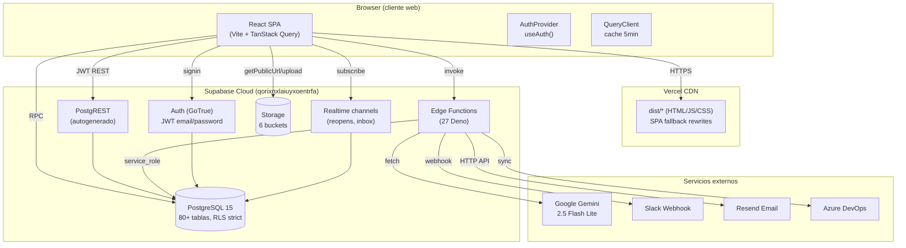
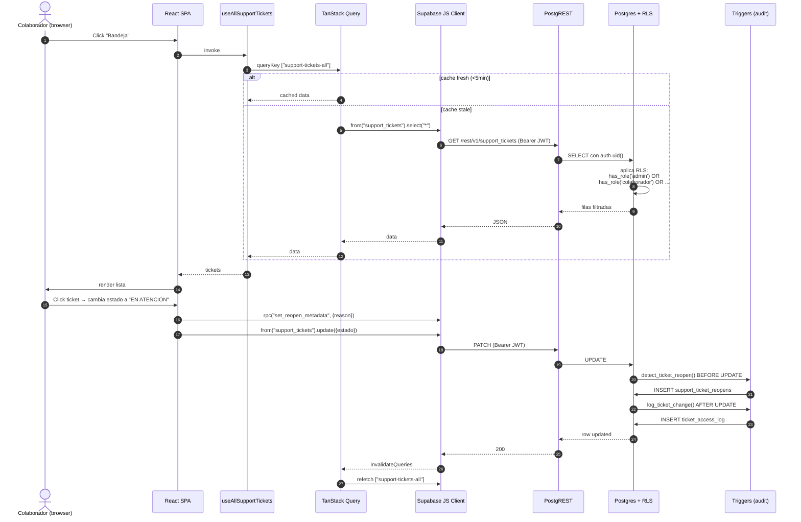
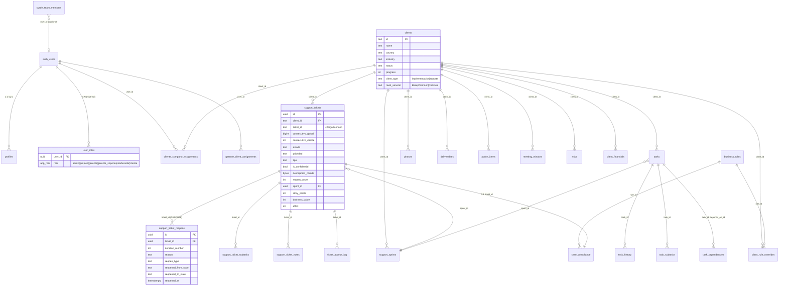
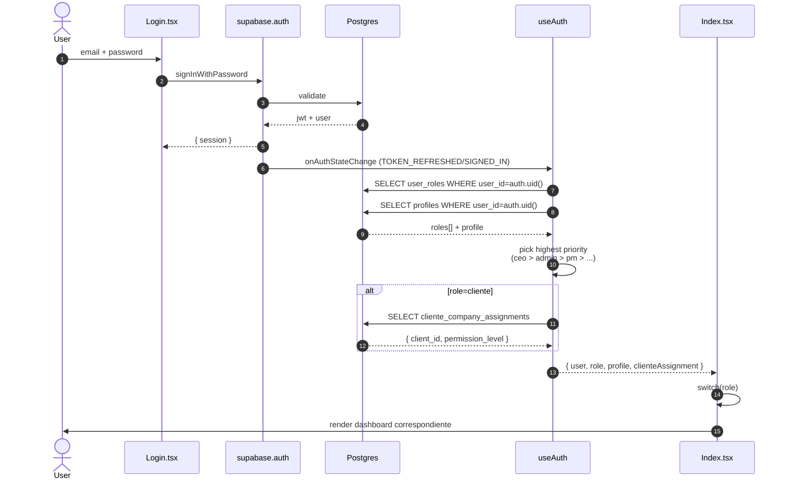
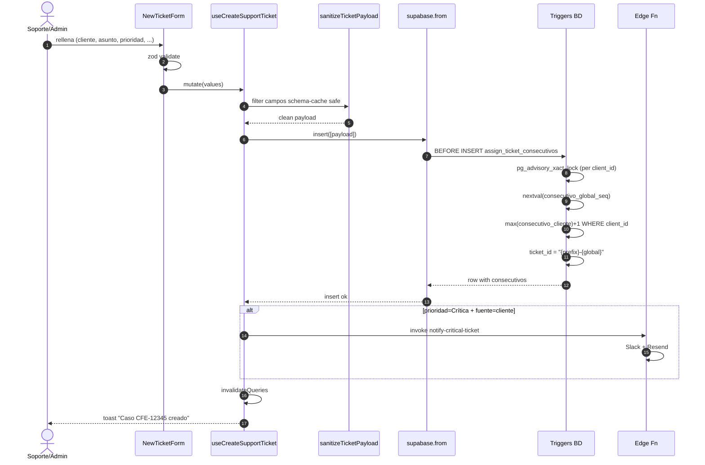
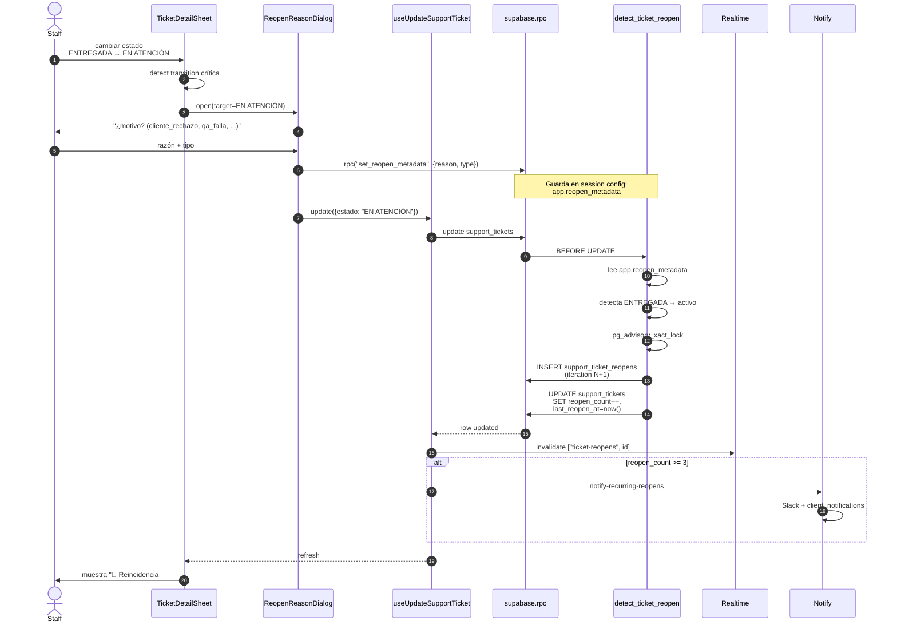
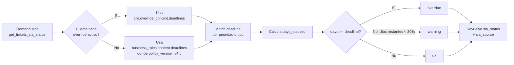
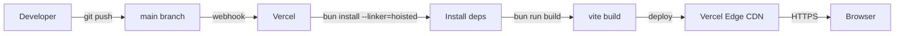

# SVA ERP — Architecture Deep Dive

> **Tipo de documento:** Onboarding técnico maestro
> **Audiencia:** Senior engineers que se incorporan al proyecto, COO, auditores externos
> **Fecha de generación:** 2026-05-04
> **Commit base:** `3cbcbd1` (rama `main`)
> **Repo de referencia:** `awt-spec/dashboard-implementaci-nes` → Vercel autodeploy
> **Convención de citas:** `ruta/relativa.tsx:LÍNEA` desde la raíz del repo

---

## Tabla de contenidos

1. [Resumen Ejecutivo](#1-resumen-ejecutivo)
2. [Stack Tecnológico](#2-stack-tecnológico)
3. [Arquitectura General](#3-arquitectura-general)
4. [Estructura de Directorios](#4-estructura-de-directorios)
5. [Backend — Edge Functions + Postgres](#5-backend--edge-functions--postgres)
6. [Frontend — React SPA](#6-frontend--react-spa)
7. [Base de Datos](#7-base-de-datos)
8. [Flujos Funcionales Críticos](#8-flujos-funcionales-críticos)
9. [Seguridad](#9-seguridad)
10. [Testing](#10-testing)
11. [DevOps e Infraestructura](#11-devops-e-infraestructura)
12. [Decisiones Técnicas y Deuda](#12-decisiones-técnicas-y-deuda)
13. [Cómo Levantar el Proyecto Localmente](#13-cómo-levantar-el-proyecto-localmente)
14. [Glosario y Referencias](#14-glosario-y-referencias)

---

## 1. Resumen Ejecutivo

**SVA ERP** es la plataforma interna de SYSDE Internacional (consultora de software con 30+ colaboradores y ~30 clientes activos en LATAM) que unifica **gestión de soporte (tickets)**, **implementación de proyectos (sprints scrum)** y **gestión ejecutiva (CEO/PM)**. Reemplaza tres sistemas separados: el legacy "Gurunet" para soporte, hojas de Excel para inconformidades/reincidencias, y dashboards manuales para C-level.

**El problema que resuelve** es la fragmentación operativa: hasta ahora un caso de soporte se rastreaba en Gurunet, sus reincidencias en un Excel mantenido a mano por la COO, las horas en otro Excel, y los compromisos contractuales en un PDF firmado guardado en email. SVA ERP centraliza todo esto en un solo PostgreSQL con vistas separadas por rol — el cliente ve solo "EN ATENCIÓN" mientras internamente el ticket lleva la etiqueta `🔁 Reincidencia #3`. La política SLA v4.5 se aplica server-side y admite override por contrato cliente.

**Estado:** **Producción, post-MVP**. Backend en `qorixnxlaiuyxoentrfa.supabase.co`, frontend en Vercel (URL no documentada en repo público — ver §13). ~150 tickets soporte vivos + 2099 tasks de implementación, 122 sprints (1 activo + 109 históricos + 12 planificados por cliente), 30+ usuarios humanos, 8 cliente-portales. Health score QA ≥92/100 (`scripts/qa-database.mjs`). El producto es estable pero sigue evolucionando — la última sesión de auditoría (2026-05-03 → 04) cerró huecos RLS heredados del bootstrap inicial y activó `noUnusedLocals` en TypeScript.

> ⚠️ **Origen del codebase:** Empezó como un proyecto de [Lovable](https://lovable.dev/) (`README.md:1-13`, `vite.config.ts:4` importa `lovable-tagger`, `index.html:9` `<meta name="author" content="Lovable" />`). El README aún apunta a Lovable y debería reescribirse — ver §12.

---

## 2. Stack Tecnológico

### 2.1 Frontend (cliente web)

| Categoría | Tecnología | Versión | Notas |
|---|---|---|---|
| Lenguaje | TypeScript | 5.9.3 | `strict: false`, `noImplicitAny: false`, `strictNullChecks: false`, `noUnusedLocals: true` (activado 2026-05-04). Ver `tsconfig.app.json` |
| Framework UI | React | 18.3.1 | SPA pura. `react-dom/client.createRoot` en `src/main.tsx:5` |
| Bundler | Vite | 5.4.20 | Plugin SWC (`@vitejs/plugin-react-swc`). HMR overlay deshabilitado (`vite.config.ts:11-13`). Puerto dev 8080 |
| Styling | Tailwind CSS | 3.4.19 | Custom tokens HSL (`src/index.css:5-103`) + `tailwindcss-animate`. Soporte light/dark via `.dark` class |
| Component library | shadcn-ui | (manual) | 49 archivos en `src/components/ui/`. Sobre Radix UI Primitives 1.x–2.x |
| State server | TanStack Query | 5.100.9 | `staleTime: 5min`, `gcTime: 10min`, `refetchOnWindowFocus: false`, `retry: 1` (`src/App.tsx:34-43`) |
| State client | React Context | 18.x | Solo `AuthProvider` (`src/hooks/useAuth.tsx`). No hay Redux/Zustand |
| Routing | React Router DOM | 6.30.3 | 7 rutas (`src/App.tsx:60-67`) |
| Charts | Recharts | 2.15.4 | Velocity, burndown, CFD, distribuciones |
| Animation | Framer Motion | 12.38.0 | Transiciones de sheet, page enter |
| Forms | React Hook Form + Zod | 7.75.0 / 3.25.76 | `@hookform/resolvers/zod` |
| PDF export | jsPDF + html2canvas | 4.2.1 / 1.4.1 | Para minutas y reportes |
| Toasts | Sonner + radix-toast | 1.7.4 | Sonner es el principal (`<Sonner />` en `src/App.tsx:55`) |
| Iconos | Lucide React | 0.462.0 | ~500 iconos importados a través del codebase |
| Drag-grid | react-grid-layout | 2.2.3 | Solo para `MondayGridDashboard` (Colaborador) |
| Markdown | react-markdown + remark-gfm | 9.0.1 / 4.0.0 | Render de respuestas de IA |

### 2.2 Backend (Supabase)

| Categoría | Tecnología | Notas |
|---|---|---|
| BaaS | Supabase | Project `qorixnxlaiuyxoentrfa` (hosted). Stack: PostgreSQL 15 + GoTrue + PostgREST + Storage + Edge Functions |
| Postgres | 15.x | 98 migraciones SQL (`supabase/migrations/`), 80+ tablas, ~15 funciones SECURITY DEFINER, ~10 triggers, 2 vistas (`support_reopens_summary`) |
| Auth | GoTrue | JWT, email/password, sin OAuth providers configurados. `auth.users` administrada por Supabase, vinculada a `public.profiles` y `public.user_roles` |
| Edge Functions | Deno + esm.sh | 27 funciones activas + 1 deprecated (`reset-passwords`). Ver §5 |
| Storage | Supabase Storage | 6 buckets: `task-attachments`, `presentation-media`, `team-cvs` (privado), `team-avatars`, `support-ticket-attachments`, `minute-feedback-media` |
| Cifrado | pgcrypto | `extensions.pgp_sym_encrypt/decrypt` para `support_tickets.descripcion_cifrada` cuando `is_confidential=true`. Clave en `app.encryption_key` GUC o env var (`supabase/migrations/20260422160000_ticket_security.sql:60-98`) |

### 2.3 Servicios externos

| Servicio | Variable env | Propósito | Estado |
|---|---|---|---|
| **Google Gemini** (via OpenAI-compat endpoint) | `GEMINI_API_KEY` | LLM principal (`gemini-2.5-flash-lite` por default). Helper: `lovableCompatFetch` en `supabase/functions/_shared/cors.ts:48-136` con retry/backoff exponencial para 429/503 | ✅ Activo |
| **Slack** | `SLACK_WEBHOOK_URL` | Webhook para `notify-critical-ticket` y `notify-recurring-reopens` | Best-effort (no rompe si falla) |
| **Resend** | `RESEND_API_KEY` + `ONCALL_EMAILS` | Email transaccional (`send-notification-email`) | Opcional |
| **Azure DevOps** | `AZURE_DEVOPS_PAT` | Sync bidireccional via `sync-devops` edge function | Disponible, no en uso prod |

> ❓ **El antiguo plan apuntaba a Anthropic Claude como proveedor de IA**, pero `_shared/cors.ts:48-49` evidencia claramente que el endpoint productivo es **Google Gemini** vía `https://generativelanguage.googleapis.com/v1beta/openai/chat/completions`. La variable env `LOVABLE_API_KEY` mencionada en `scripts/README.md:54` está obsoleta — la nueva es `GEMINI_API_KEY` (`_shared/cors.ts:87`). **Validar con DevOps si esto cambió recientemente o si hay tenants distintos.**

### 2.4 Infraestructura y herramientas

| Categoría | Herramienta | Notas |
|---|---|---|
| Cloud (frontend) | Vercel | `vercel.json` define `framework: vite`, `buildCommand: bun run build`, `installCommand: bun install --linker=hoisted`. Cache 1 año en `/assets/*` |
| Cloud (backend) | Supabase Cloud | Plan no documentado en repo |
| Package manager | Bun | `bun.lock` (no `package-lock.json`). Necesario `--linker=hoisted` para que Vercel resuelva `vite/node_modules/esbuild` |
| Linter | ESLint 9 + typescript-eslint | `eslint.config.js` (flat config). `@typescript-eslint/no-unused-vars: off` (delegado a tsc) |
| Testing | Vitest 3.2.4 + Testing Library | 35 tests (3 archivos), `jsdom` env. `src/test/setup.ts` |
| Pre-commit hooks | (ninguno) | ⚠️ No hay `husky`/`lint-staged`/`simple-git-hooks` configurado |
| CI/CD | Vercel auto-deploy | Sin GitHub Actions ni workflows custom (`/.github/workflows/` no existe) |
| IaC | Supabase migrations | 98 archivos `.sql` aplicados via `supabase db push` o `scripts/deploy-fixes.sh` |

---

## 3. Arquitectura General

### 3.1 Patrón

**SPA Cliente + BaaS** (Backend-as-a-Service). No hay backend propio escrito — toda la lógica server-side vive en:

1. **Postgres con RLS estricto** — la mayoría de las queries CRUD son inseguras desde el cliente solo si las RLS están bien definidas. Funciones `SECURITY DEFINER` encapsulan lógica que requiere bypass de RLS (ej: `get_tickets_sla_status`).
2. **Triggers SQL** — para invariantes (asignación de consecutivos, detección de reopens, audit trail).
3. **Edge Functions Deno** — para cosas que requieren secretos (Gemini API key, Resend, Slack), composición de varios queries, o validación de roles complejos antes de exponer datos.
4. **Frontend SPA** — orquesta el ciclo de vida de UI, cachea con TanStack Query, dispara edge functions cuando hace falta una operación con secretos.

No hay microservicios, no hay colas (todo síncrono), no hay BFF. Es una arquitectura **monolito-frontend + DB-driven**.

### 3.2 Diagrama de alto nivel



### 3.3 Capas (responsabilidades)

| Capa | Responsable de... | Ejemplo |
|---|---|---|
| **UI** (`src/pages/`, `src/components/`) | Render condicional por rol; UX; despacho de eventos custom (`overdue:open`) | `Index.tsx` decide qué dashboard mostrar según `useAuth().role` |
| **Hooks** (`src/hooks/`) | Encapsular `useQuery`/`useMutation`; transformar respuestas REST a tipos de dominio; invalidar cache | `useSupportTickets.ts` con sanitización de payload + retry de schema cache |
| **Cliente Supabase** (`src/integrations/supabase/`) | Cliente único con tipos generados (`types.ts`) | `client.ts:11-17` |
| **Edge Functions** (`supabase/functions/`) | Operaciones con secretos, lógica de IA, validaciones de role server-side | `executive-ai-chat`, `manage-users` |
| **Postgres RLS** (migraciones) | Última línea de defensa — incluso si el frontend pide datos prohibidos, RLS los rechaza | `is_staff_user()`, `user_can_see_client()` |
| **Postgres Triggers** | Invariantes (consecutivos, reopens, audit) que deben aplicarse pase lo que pase | `assign_ticket_consecutivos()`, `detect_ticket_reopen()` |

### 3.4 Flujo de una request típica

**Caso:** un colaborador abre un ticket en su bandeja de soporte.



---

## 4. Estructura de Directorios

```
sva-erp-deploy/
├── public/                       # Assets servidos tal cual (favicon, robots, etc)
├── dist/                         # Build output (gitignored)
├── src/
│   ├── App.tsx                   # Router + providers + lazy routes
│   ├── main.tsx                  # createRoot
│   ├── index.css                 # Tailwind + design tokens HSL
│   ├── App.css                   # Estilos globales legacy
│   ├── vite-env.d.ts             # Tipos de Vite
│   ├── assets/                   # Logos SYSDE (.png) — no usar para imports dinámicos
│   ├── data/
│   │   └── projectData.ts        # Tipos TS de dominio (Client, Phase, Deliverable...)
│   ├── integrations/
│   │   └── supabase/
│   │       ├── client.ts         # createClient() con auth localStorage + autorefresh
│   │       └── types.ts          # Tipos generados por `supabase gen types` (Database)
│   ├── hooks/                    # 38 hooks: useQuery/useMutation por dominio
│   │   ├── useAuth.tsx           # AuthProvider, ROLE_PRIORITY, fetchUserData
│   │   ├── useSupportTickets.ts  # CRUD tickets + sanitize + retry schema
│   │   ├── useTeamScrum.ts       # Items scrum unificados (tasks + tickets)
│   │   ├── useTicketsSLAStatus.ts # RPC get_tickets_sla_status
│   │   └── ...
│   ├── lib/
│   │   ├── utils.ts              # cn() (clsx + tailwind-merge)
│   │   ├── ticketStatus.ts       # Estados ticket → status normalizado
│   │   ├── exportCsv.ts          # Generación CSV
│   │   ├── exportPdf.ts          # PDF de minuta cliente
│   │   ├── exportReportPdf.ts    # PDF de reporte ejecutivo
│   │   └── ensureTaskInDb.ts     # Helper para crear task on-demand
│   ├── pages/                    # 12 pages — cada una es una ruta o "landing dashboard"
│   │   ├── Index.tsx             # Hub principal — switch por rol
│   │   ├── Login.tsx             # Auth + lista de cuentas demo
│   │   ├── ColaboradorDashboard.tsx  # Vista Jira-style fullscreen
│   │   ├── TeamScrumDashboard.tsx    # Backlog + sprints + analytics
│   │   ├── TasksDashboard.tsx
│   │   ├── AdminUsers.tsx
│   │   ├── MemberProfile.tsx
│   │   ├── Report.tsx            # Reporte ejecutivo PDF
│   │   ├── Shared*.tsx           # Vistas públicas con token
│   │   └── NotFound.tsx
│   ├── components/
│   │   ├── ui/                   # 49 componentes shadcn (Button, Sheet, Dialog, ...)
│   │   ├── dashboard/            # 19: AppSidebar, ExecutiveOverview, CEODashboard, ...
│   │   ├── support/              # 41: SupportDashboard, TicketDetailSheet, OverdueTicketsSheet, ...
│   │   ├── scrum/                # 17: SprintBoard, BacklogView, ActiveSprintHub, ...
│   │   ├── clients/              # 21: ClientList, ClientDetail, MinutaPresentation, ...
│   │   ├── colaborador/          # 12: MondayGridDashboard, MiSprintCard, FocusCard, ...
│   │   ├── team/                 # 31: TimeTrackingDashboard, MemberAIAgentPanel, ...
│   │   ├── tasks/                # 11: TaskBoard, TaskDetailModal, TaskViewSwitcher, ...
│   │   ├── admin/                # 7: SystemUsersTab, RBACPermissionsTab, ...
│   │   ├── settings/             # 5: ConfigurationHub, BusinessRulesPanel, ...
│   │   ├── policy/               # 1: ActivePolicyBar (versión policy global)
│   │   └── NavLink.tsx
│   └── test/
│       └── setup.ts              # Vitest setup (jest-dom matchers)
├── supabase/
│   ├── config.toml               # Supabase CLI config (mínimo)
│   ├── migrations/               # 98 archivos .sql ordenados por timestamp
│   └── functions/
│       ├── _shared/
│       │   ├── auth.ts           # requireAuth, requireRole, canActOnUser, canAccessMember
│       │   ├── cors.ts           # corsHeaders + lovableCompatFetch (Gemini)
│       │   └── ticketStatus.ts   # (no leído — probablemente helper de normalización)
│       └── <27 funciones>/
│           └── index.ts          # Deno.serve handler
├── scripts/                      # 17 .mjs/.sh para imports, smoke, QA, stress test
│   ├── deploy-fixes.sh           # Orquesta deploy edge fns + migraciones
│   ├── qa-database.mjs           # 30+ chequeos con score 0-100
│   ├── stress-test.mjs           # Reads concurrentes, race conditions, p50/p95/p99
│   ├── smoke-*.mjs               # CRUD, policies, tickets, AI fns, saved views
│   ├── import-*.mjs              # Generadores SQL desde Excel/CSV
│   ├── seed-*.mjs                # Crea cliente users / Carlos / CEO
│   ├── inspect-cliente-links.mjs # Verifica integridad de cliente_company_assignments
│   └── verify-cliente-logins.mjs
├── package.json
├── bun.lock                      # Reproducibilidad (no usar npm install)
├── vite.config.ts                # Bundler: SWC, alias @/*, port 8080
├── vitest.config.ts              # Tests: jsdom, setup
├── tsconfig.{json,app.json,node.json}  # TS configs (app.json es el efectivo)
├── tailwind.config.ts            # Custom HSL tokens + animations
├── eslint.config.js              # Flat config, no-unused-vars off (delegado a tsc)
├── components.json               # shadcn-ui aliases
├── vercel.json                   # Build con bun --linker=hoisted, SPA rewrites
├── postcss.config.js             # Tailwind + autoprefixer
├── index.html                    # Root HTML (Inter + Montserrat fonts)
├── README.md                     # ⚠️ Lovable boilerplate, requiere reescritura
└── .env                          # SUPABASE_URL + ANON_KEY (público, OK)
```

### 4.1 Convenciones de nomenclatura detectadas

- **Componentes**: PascalCase (`SupportDashboard.tsx`).
- **Hooks**: `useNombre.ts(x)` — todos exportan al menos un hook.
- **Pages**: PascalCase, una página = una ruta (excepto `Index.tsx` que es un hub).
- **Migrations**: `<YYYYMMDDHHMMSS>_<slug>.sql` — los iniciales (Lovable) tienen UUID en el slug, las nuevas usan slug descriptivo.
- **Edge functions**: `kebab-case` que matchea el endpoint URL (`case-strategy-ai`, `notify-critical-ticket`).
- **Scripts**: `kebab-case.mjs` con README documentado.
- **Database**: `snake_case`, plural para tablas (`support_tickets`), singular para enums (`app_role`).
- **CSS vars**: `--name` en HSL solo (sin `hsl()` wrapping en la definición — se aplica con `hsl(var(--name))`).

---

## 5. Backend — Edge Functions + Postgres

> No hay un backend Node/Python. El "backend" se compone de tres piezas: **PostgREST autogenerado**, **27 Edge Functions Deno**, y **lógica SQL nativa** (RLS + triggers + RPCs).

### 5.1 Endpoints disponibles vía PostgREST

PostgREST expone automáticamente cada tabla como REST. La autorización vive **íntegramente** en RLS. No hay endpoints custom REST escritos a mano. Todas las queries son construidas desde el cliente JS:

```ts
// src/integrations/supabase/client.ts:11-17
export const supabase = createClient<Database>(SUPABASE_URL, SUPABASE_PUBLISHABLE_KEY, {
  auth: { storage: localStorage, persistSession: true, autoRefreshToken: true }
});
```

Las RPCs disponibles (sí son endpoints "lógicos") están listadas en §7.4.

### 5.2 Edge Functions (Deno) — Inventario completo

Todas viven en `supabase/functions/<nombre>/index.ts` y aceptan `POST` + `OPTIONS` (preflight). Helpers compartidos en `_shared/`.

#### Helper compartido `_shared/auth.ts`

`supabase/functions/_shared/auth.ts:28-110` define:
- `requireAuth(req)` — extrae JWT del header, valida con GoTrue, devuelve `{ userId, email, userClient (con JWT), adminClient (service_role) }`. Lanza `AuthError(401)` si falla.
- `requireRole(ctx, allowed[])` — lee `user_roles` con admin client, lanza 403 si no matchea.
- `canActOnUser(ctx, targetUserId, privilegedRoles)` — true si caller==target o caller tiene rol privilegiado.
- `canAccessMember(ctx, memberId)` — true si caller es owner del `sysde_team_members` o tiene rol privilegiado.
- `authErrorResponse(err, corsHeaders)` — wrapper que convierte excepciones en Response con status correcto.

#### Helper de IA `_shared/cors.ts:48-204`

- `lovableCompatFetch(body)` — llama Google Gemini con retry exponencial (delays `[1500, 4000, 10000]`) en 429/503/500/502. Timeout default 45s.
- `anthropicTool<T>({system, userPrompt, tool, ...})` — wrapper sobre `lovableCompatFetch` que **fuerza tool-use** y devuelve `{result: T, usage}`. **Importante:** el nombre `anthropicTool` es legacy — usa Gemini OpenAI-compat, no Anthropic API. Ver §12.

#### Tabla de funciones

| Función | HTTP | Auth | IA | Propósito |
|---|---|---|---|---|
| `analyze-career-path` | POST | JWT + `canAccessMember` | Gemini 2.5 Flash | Roadmap personalizado de carrera |
| `analyze-cv` | POST | JWT + `canAccessMember` | Gemini | Parsea CV, mapea a clientes SYSDE |
| `analyze-team-activity` | POST | JWT + `canActOnUser` | Gemini | Insights de actividad de un colaborador |
| `analyze-team-level` | POST | JWT + `requireRole([admin,pm,gerente])` | Gemini 2.5 Flash | Resumen agregado del equipo (skills, productividad) |
| `analyze-team-scrum` | POST | JWT + `requireRole(...)` | Gemini 2.5 Flash | Forecast de sprints, loadByOwner |
| `case-strategy-ai` | POST | JWT + role + rate limit + `assertNotCliente` | Gemini 2.5 Flash Lite | Estrategia IA por caso (persiste en `pm_ai_analysis`) |
| `classify-tickets` | POST | JWT + role | Gemini | Clasificación automática + redacción de confidencial |
| `client-strategy-ai` | POST | JWT + role + rate limit | Gemini 2.5 Flash Lite | Estrategia por cliente |
| `decrypt-ticket` | POST | JWT + `requireRole([admin, pm])` | — | Descifra `descripcion_cifrada` con `pgp_sym_decrypt` |
| `evaluate-case-compliance` | POST | JWT + role | Gemini | Evalúa cumplimiento SLA + checklist |
| `executive-ai-chat` | POST | JWT + role + rate limit | Gemini 2.5 Flash | Chat ejecutivo sobre portafolio |
| `forecast-sprint` | POST | JWT + role | Gemini 2.5 Flash Lite | Predice cuándo termina el backlog por velocity |
| `manage-users` | POST | Bearer + role-check custom | — | CRUD usuarios. Actions: `create`, `update_role`, `delete`, `update_password`, `update_email`, `create_cliente`, `update_cliente_permission`, `remove_cliente_assignment`, `list_cliente_users`, `create_team_access`, `create_bulk_team_access` |
| `member-agent-chat` | POST | JWT + `canAccessMember` | Gemini | Chat mentor por colaborador |
| `member-agent-weekly-digest` | POST | JWT + `canAccessMember` | Gemini | Resumen semanal del miembro |
| `mentor-ai` | POST | JWT + ownership | Gemini | Asistente técnico según rol del miembro |
| `notify-critical-ticket` | POST | `requireAuth` | — | Slack + Resend cuando se crea ticket crítico |
| `notify-recurring-reopens` | POST | `requireAuth` | — | Slack cuando ticket cruza ≥3 reincidencias |
| `parse-time-entry` | POST | `requireAuth` (user only) | — | Parsea texto natural → time entry estructurado |
| `pm-ai-analysis` | POST | JWT + role | Gemini | Análisis estratégico full-portfolio |
| `policy-ai-assistant` | POST | JWT + role | Gemini | Asistente de políticas |
| `recommend-team-for-client` | POST | JWT + role | Gemini | Recomienda equipo para nuevo proyecto por skills/capacity |
| `reset-passwords` | POST | — | — | ⚠️ **DEPRECATED** — devuelve 410 Gone (contenía credenciales hardcodeadas) |
| `send-notification-email` | POST | service_role (sin JWT) | — | Procesa cola de `email_notifications`, envía vía Resend |
| `summarize-transcript` | POST | `requireAuth` | Gemini 2.5 Flash Lite | Resume transcripción de reunión a `{title, summary, agreements, actionItems, taskUpdates}` |
| `sva-strategy` | POST | JWT + role | Gemini 2.5 Flash Lite | Plan estratégico semanal del equipo SVA |
| `sync-devops` | POST | JWT + role | — | Sync bidireccional con Azure DevOps |

> ⚠️ **Patrón de seguridad consistente:** funciones de IA aplican `assertNotCliente` (bloquea rol `cliente`) y rate-limit. ✅ La mayoría usa `requireAuth` + `requireRole`. ⚠️ `manage-users` implementa el role-check inline (no usa `requireRole` del helper) — funcional pero no DRY.

### 5.3 Background jobs / colas

**No existen.** No hay scheduler en el repo (no `pg_cron`, no GitHub Actions, no Vercel Cron). El email se procesa cuando algo invoca `send-notification-email` manualmente.

> ⚠️ **Deuda técnica:** `notify-critical-ticket` y `notify-recurring-reopens` se invocan desde el frontend tras una mutación. Si el browser cierra la pestaña antes, la notificación se pierde. Lo correcto sería un trigger SQL → `pg_notify` → cron edge function. Ver §12.

### 5.4 Manejo de errores

- **Edge functions** devuelven `{ error: string }` con status apropiado (`auth.ts:113-119` → `authErrorResponse`).
- **Frontend** usa `try/catch` en `mutationFn` + `toast.error(e.message)`.
- **Postgres** lanza `RAISE EXCEPTION` o retorna error code que PostgREST traduce a HTTP 4xx/5xx.

No hay agregación centralizada de logs (Sentry, Logtail, etc.). Solo `console.error` que va al output de Edge Function en Supabase Dashboard.

---

## 6. Frontend — React SPA

### 6.1 Tipo

**SPA pura** — no hay SSR ni SSG. Todo se hidrata en el cliente. La razón es simple: el contenido es 100% privado/auth-gated, así que el SEO no aplica. Las únicas rutas públicas (`/shared/:token`, `/shared-support/:token`, `/historial-caso/:token`) son JSON-driven y se renderizan client-side desde un snapshot.

### 6.2 Routing

Definido en `src/App.tsx:60-67`:

| Ruta | Componente | Lazy | Auth | Propósito |
|---|---|---|---|---|
| `/` | `AuthGate` → `Index` (logged) o `Login` | Eager | Variable | Hub principal, dispatch por rol |
| `/report` | `Report` | ✅ | Sí | Reporte ejecutivo PDF |
| `/shared/:token` | `SharedPresentation` | ✅ | Anónimo | Presentación cliente (snapshot) |
| `/shared-support/:token` | `SharedSupportPresentation` | ✅ | Anónimo | Presentación soporte |
| `/historial-caso/:token` | `SharedTicketHistory` | ✅ | Anónimo | Historial de un ticket |
| `/team/:memberId` | `MemberProfile` | ✅ | Sí | Perfil colaborador |
| `*` | `NotFound` | ✅ | — | 404 |

**No hay router anidado.** `Index.tsx:120-263` hace switch por `role` y `activeSection` (state local + persisted en localStorage):

```ts
// src/pages/Index.tsx:120-132 (esquemático)
if (role === "colaborador") return <ColaboradorDashboard />;
if (role === "cliente")     return <ClientPortalDashboard />;
if (role === "ceo")         return <CEODashboard />;
// el resto: AppSidebar + sección activa via activeSection state
```

### 6.3 Estado

| Tipo | Mecanismo | Ejemplo |
|---|---|---|
| **Server state** | TanStack Query | Toda data que viene de Supabase |
| **Auth state** | React Context | `AuthProvider` en `src/hooks/useAuth.tsx:27` |
| **UI ephemeral** | `useState` local | Open/closed de modals, filtros |
| **Persistence cross-tab** | `localStorage` | Sección activa (`sva-erp:active-section`), sub-tab del soporte (`sva-erp:support-active-tab`) |
| **Persistence intra-tab** | `sessionStorage` | Flag `sysde_session_active` para detectar primera carga vs reload (`useAuth.tsx:106-130`) |

> ✅ **Decisión arquitectónica buena:** No hay Redux/Zustand. Toda la "global state" que importa es server state, y TanStack Query es el responsable. El cache (5min stale, 10min gc) hace que la app se sienta instantánea para reaperturas frecuentes.

### 6.4 Sistema de estilos

**Tailwind 3.4 + design tokens HSL** (`src/index.css:5-103`).

Convención: usar siempre `hsl(var(--token))` — los tokens están en HSL "puro" (sin `hsl()` wrap) para permitir alpha overrides:

```css
.bg-destructive/50 { background-color: hsl(var(--destructive) / 0.5); }
```

Tokens custom que extienden shadcn:
- `--success`, `--warning`, `--info` (no estándar shadcn)
- `--sidebar-*` (background rojo SYSDE en light mode, dark slate en dark mode)
- Tipografías Inter (body) + Montserrat (display) precargadas en `index.html:13-14`

Modo dark: `.dark` en `<html>`. Toggle persistido en sesión vía `setDark(true|false)` (`Index.tsx:76`).

### 6.5 Comunicación con backend

| Operación | Patrón |
|---|---|
| **Read** | `useQuery({queryKey, queryFn: () => supabase.from(...).select(...)})` |
| **Write** | `useMutation` → invalidate keys relacionados |
| **RPC** | `supabase.rpc("nombre_funcion", args)` (con cast `as any` cuando los types generados no la cubren) |
| **Edge Function** | `supabase.functions.invoke("nombre", { body })` |
| **Realtime** | `supabase.channel(...).on("postgres_changes", ...)` — ver `SupportInbox.tsx:367-380` |
| **Storage** | `supabase.storage.from("bucket").upload/getPublicUrl` |

### 6.6 Forms y validación

**React Hook Form + Zod**. Patrón establecido en `NewTicketForm.tsx`:

```ts
// src/components/support/NewTicketForm.tsx:24-48 (esquemático)
const ticketSchema = z.object({
  client_id: z.string().min(1, "Cliente requerido"),
  asunto: z.string().trim().min(3).max(200),
  // ...
});
type TicketForm = z.infer<typeof ticketSchema>;

const form = useForm<TicketForm>({
  resolver: zodResolver(ticketSchema),
  defaultValues: { ... }
});
```

### 6.7 Optimizaciones de rendimiento

| Optimización | Ubicación | Impacto |
|---|---|---|
| **`React.lazy()` + Suspense** | `App.tsx:18-23` (rutas) y `Index.tsx:16-26` (dashboards por rol) | Bundle inicial -41% (3.5MB → 2.0MB) |
| **TanStack Query cache** | `App.tsx:34-43` | `staleTime 5min` + `refetchOnWindowFocus: false` evita N llamadas redundantes |
| **Paginación manual** | `useTeamScrum.ts:48-65` (`fetchAllPages`) | Resuelve límite 1000 rows del REST de Supabase para clientes con +1000 tickets |
| **Memoización con `useMemo`** | Casi todos los hooks complejos | Evita recalcular WSJF, filtros, etc. en re-renders |
| **`hmr.overlay: false`** | `vite.config.ts:11-13` | El overlay de errores Vite tapaba el design del COO durante demos |
| **Cache headers en `/assets/*`** | `vercel.json:11-14` | `max-age=31536000, immutable` (1 año) |

### 6.8 Componentes reutilizables clave

| Componente | Ubicación | Propósito |
|---|---|---|
| `AppSidebar` | `src/components/dashboard/AppSidebar.tsx` | Sidebar global con clientes + secciones |
| `OverdueTicketsSheet` | `src/components/support/OverdueTicketsSheet.tsx` | Sheet global disparable por `window.dispatchEvent("overdue:open")` |
| `TicketDetailSheet` | `src/components/support/TicketDetailSheet.tsx` | Sheet con 6 tabs (Detalle, Notas, Subtareas, Estrategia, Reincidencias, Histórico) |
| `BacklogView` | `src/components/scrum/BacklogView.tsx` | 4 vistas (WSJF, por cliente, por responsable, tabla) |
| `MondayGridDashboard` | `src/components/colaborador/MondayGridDashboard.tsx` | React-grid-layout drag & drop de widgets |
| `MinutaPresentation` | `src/components/clients/MinutaPresentation.tsx` | Presentación de minuta con export PDF |

### 6.9 Inventario completo de hooks (`src/hooks/`)

| Hook | Propósito | Tablas / Edge fn | Tipo |
|---|---|---|---|
| `useAuth` | Provider de auth + ROLE_PRIORITY + clienteAssignment | `auth.users`, `profiles`, `user_roles`, `cliente_company_assignments` | Context + Query |
| `useActivityTracker` | Registra eventos UI en logs | `user_activity_log`, `user_sessions` | Mutation |
| `use-mobile` | Detecta breakpoint <768px | (none) | Local |
| `use-toast` | Wrapper sobre radix-toast con queue | (none) | Context |
| `useClients` | CRUD clientes + relaciones | `clients`, `phases`, `tasks`, `comments` | Query + Mutation |
| `useClientContracts` | Contratos y SLAs específicos | `client_contracts`, `client_slas` | Query + Mutation |
| `useClientStrategy` | Salud, churn, upsells | (edge function) | Query |
| `useSupportTickets` | Hook central — múltiples sub-hooks (`useSupportClients`, `useAllSupportTickets`, `useCreateSupportTicket`, `useUpdateSupportTicket`, `useDeleteSupportTicket`, `useDecryptTicket`) | `support_tickets`, `clients` | Query + Mutation |
| `useAllSupportTickets` | Todos los tickets (paginación) | `support_tickets` | Query |
| `useSupportClients` | Clientes con `client_type='soporte'` | `clients` | Query |
| `useSupportTicketDetails` | Subtareas, tags, attachments | `support_ticket_subtasks`, `support_ticket_tags`, `support_ticket_attachments`, `support_ticket_notes` | Query + Mutation |
| `useTicketHistory` | Audit trail por ticket | `ticket_access_log`, `support_ticket_notes` | Query |
| `useTicketReopens` | Reincidencias de un ticket | `support_ticket_reopens`, `support_reopens_summary` | Query |
| `useReopenTicket` | Aplica reapertura con metadata | `support_tickets` (UPDATE) + `set_reopen_metadata` RPC | Mutation |
| `useTicketsSLAStatus` | Map<ticket_id, SLA> por ticket | `get_tickets_sla_status` RPC | Query |
| `useSLASummary` | Resumen global (overdue/warning/ok) | `get_sla_summary` RPC | Query |
| `useScrum` | Sprints CRUD | `support_sprints` | Query + Mutation |
| `useTeamScrum` | Items unificados (tasks + tickets) | `tasks`, `support_tickets`, `clients` | Query (con `fetchAllPages`) |
| `useSprintCeremonies` | Dailies, retros, reviews | `sprint_dailies`, `sprint_retrospectives`, `sprint_reviews` | Query + Mutation |
| `useCaseStrategy` | Recomendación IA por caso | `case-strategy-ai` (edge fn) | Query |
| `useCaseCompliance` | Compliance + políticas | `case_compliance`, `business_rules` | Query + Mutation |
| `useTeamMembers` | Listado equipo SYSDE | `sysde_team_members`, `client_team_members` | Query |
| `useMyTeamMember` | Mi fila en sysde_team_members | `sysde_team_members` | Query |
| `useMemberProfile` | Capacidad, certs, carrera | `team_member_capacity`, `team_member_certifications`, `team_career_paths` | Query + Mutation |
| `useMemberAgent` | Config + chat con agente IA | `member_ai_agents`, `member_ai_conversations` | Query + Mutation |
| `useTeamEngagement` | Kudos del equipo | `team_kudos` | Query + Mutation |
| `useTeamSkills` | Skills + onboarding | `team_member_skills`, `team_onboarding` | Query + Mutation |
| `useDevOps` | Conexiones Azure DevOps | `devops_connections`, `devops_sync_logs` | Query + Mutation |
| `useBusinessRules` | Reglas globales (política v4.5) | `business_rules`, `client_rule_overrides` | Query + Mutation |
| `usePolicyAI` | Asistente IA de políticas | `policy-ai-assistant` (edge fn) | Mutation |
| `useAIUsageLogs` | Audit consumo IA | `ai_usage_logs` | Query |
| `usePMAnalysis` | Análisis IA PM agregado | `pm_ai_analysis` + `pm-ai-analysis` (edge fn) | Query + Mutation |
| `useSVAStrategy` | Plan estratégico semanal | `sva-strategy` (edge fn) + agregaciones de varias tablas | Query |
| `usePresentationData` | Snapshots de minutas | `presentation_data`, `meeting_minutes` | Query |
| `useNotifications` | Bell del header | `client_notifications`, `user_notifications` | Query (realtime ready) |
| `useSavedViews` | Vistas guardadas custom | `user_saved_views` | Query + Mutation |
| `useTaskDetails` | Detalles de una task | `tasks`, `task_subtasks`, `task_history` | Query + Mutation |
| `useColaboradorLayout` | Layout MondayGrid | `colaborador_dashboard_layouts` | Query + Mutation |
| `useTimeTracking` | Entrada de horas + goals | `work_time_entries`, `time_tracking_goals` | Query + Mutation |
| `useTimeAudit` | Auditoría time entries | `time_entry_audit_log`, `time_weekly_locks` | Query |

---

## 7. Base de Datos

### 7.1 Inventario de tablas (82 totales)

> Las tablas están agrupadas por dominio. Cada una tiene RLS habilitado (verificado tras la auditoría 2026-05-03).

#### Core / Project Management
| Tabla | Rol | Filas (prod aprox) |
|---|---|---|
| `clients` | Catálogo de clientes (`client_type: implementacion|soporte`) | 30+ |
| `client_financials` | Contrato, facturado, pagado, pendiente, horas estimadas vs usadas | ~30 |
| `client_contacts` | Contactos del cliente (gerentes, decision-makers) | — |
| `client_team_members` | Miembros del equipo del cliente | — |
| `client_contracts` | Contratos firmados por cliente | — |
| `client_slas` | SLAs específicos por cliente (legacy, reemplazado por `client_rule_overrides`) | — |
| `phases` | Fases del proyecto (Discovery, Build, Deploy, …) | — |
| `deliverables` | Entregables (con tipo, estado, due_date, version) | — |
| `action_items` | Pendientes/acciones | — |
| `meeting_minutes` | Actas de reunión (con `presentation_snapshot`, `visible_to_client`) | — |
| `risks` | Riesgos del proyecto | — |
| `comments` | Comentarios sobre clientes | — |

#### Support / Tickets
| Tabla | Rol |
|---|---|
| `support_tickets` | **Tabla central de soporte**. ~30 columnas: estado, prioridad, SLA, scrum (sprint_id, story_points), reopens, confidencial |
| `support_ticket_reopens` | Historial de reincidencias (1 fila por iteración, FK ticket_id, UNIQUE iteration_number) |
| `support_ticket_subtasks` | Sub-tareas de un ticket (con categoría) |
| `support_ticket_notes` | Notas/audit trail (con `visibility: interna|externa`) |
| `support_ticket_tags` | Tags |
| `support_ticket_attachments` | Adjuntos |
| `support_ticket_dependencies` | Dependencias (bloqueado por) |
| `ticket_access_log` | Audit log: quién leyó/editó qué ticket cuándo |
| `shared_ticket_history` | Snapshot público de historial con token expirable |
| `support_minutes` | Minutas de soporte (formato breve) |
| `support_minutes_feedback` | Feedback en minutas de soporte |
| `support_data_updates` | Log de imports masivos |

#### Scrum / Sprints
| Tabla | Rol |
|---|---|
| `support_sprints` | Sprints de 14 días. Status: `planificado|activo|completado`. 122 filas en prod (1 activo + 109 completos + 12 planificados) |
| `tasks` | Tareas de implementación (FK client_id, sprint_id). 2099 filas en prod |
| `task_history` | Audit trail vía trigger `record_task_history` |
| `task_subtasks` | Sub-tareas |
| `task_dependencies` | Dependencias |
| `task_tags` | Tags |
| `task_attachments` | Adjuntos |
| `sprint_dailies` | Daily standup notes |
| `sprint_retrospectives` | Retros |
| `sprint_reviews` | Reviews |

#### Auth / Roles
| Tabla | Rol |
|---|---|
| `profiles` | 1:1 con `auth.users` (full_name, email, avatar_url) |
| `user_roles` | N:1 con `auth.users` (role enum). Multi-row → `useAuth` resuelve por prioridad |
| `gerente_client_assignments` | Gerente ↔ cliente (1 cliente por gerente) |
| `cliente_company_assignments` | Cliente externo ↔ empresa (con permission_level: viewer/editor/admin) |
| `sysde_team_members` | Equipo SYSDE interno (puede o no tener `user_id` ligado) |

#### Policy / Rules
| Tabla | Rol |
|---|---|
| `business_rules` | Reglas globales (closure, sla, notice, checklist, signature, metric, weekly). Política activa = v4.5 |
| `client_rule_overrides` | Override de reglas por cliente (1:1 con rule_id) |
| `case_compliance` | Estado de cumplimiento por ticket (semaphore, days_remaining, ai_recommendation) |

#### Notifications
| Tabla | Rol |
|---|---|
| `email_notifications` | Cola de emails (procesada por `send-notification-email`) |
| `client_notifications` | Notificaciones a cliente (in-app) |
| `user_notifications` | Notificaciones a usuario interno |
| `mentions` | Menciones (@user) en threads |

#### AI / Strategy
| Tabla | Rol |
|---|---|
| `ai_usage_logs` | Audit completo de invocaciones IA (admin-only via RLS) |
| `pm_ai_analysis` | Análisis IA persistido (case-strategy, client-strategy, etc.) |
| `policy_ai_settings` | Config de la IA por policy version |
| `member_ai_agents` | Agentes IA personalizados por team member |
| `member_ai_conversations` | Threads de chat con agente |
| `member_ai_digests` | Digests semanales generados |
| `mentor_conversations` | Threads con `mentor-ai` |

#### Communication / Sharing
| Tabla | Rol |
|---|---|
| `communication_threads` | Hilos tipo Slack |
| `thread_messages` | Mensajes en threads |
| `message_reactions` | Reacciones (emoji) |
| `shared_presentations` | Presentaciones cliente (token + expires_at, RLS público condicional) |
| `shared_support_presentations` | Versión soporte |
| `presentation_data` | Metadata de presentaciones |
| `presentation_feedback` | Feedback en presentaciones |
| `support_presentation_feedback` | Feedback en presentaciones soporte |

#### Time tracking / Team
| Tabla | Rol |
|---|---|
| `work_time_entries` | Registro de horas (con lock semanal) |
| `time_entry_audit_log` | Audit trail |
| `time_weekly_locks` | Cierre semanal (impide editar entries cerradas) |
| `time_tracking_goals` | Goals personales |
| `team_member_capacity` | Capacity / allocations |
| `team_member_skills` | Skills + niveles |
| `team_member_certifications` | Certificaciones |
| `team_kudos` | Reconocimientos entre miembros |
| `team_badges` / `team_member_badges` | Sistema de badges |
| `team_career_paths` | Trayectoria profesional |
| `team_onboarding` | Onboarding tracker |
| `team_time_off` | Tiempo libre |
| `learning_courses` / `learning_enrollments` | Cursos + inscripciones |

#### DevOps / Misc
| Tabla | Rol |
|---|---|
| `devops_connections` | Conexiones a Azure DevOps |
| `devops_sync_logs` | Log de sincronizaciones |
| `devops_sync_mappings` | Mapeos work-item↔ticket/task |
| `user_saved_views` | Vistas guardadas custom (filtros + columnas) |
| `user_activity_log` | Log de eventos UI |
| `user_sessions` | Sesiones (no usado activamente) |
| `client_dashboard_config` | Config de dashboard por cliente |
| `colaborador_dashboard_layouts` | Layouts del MondayGrid (per user) |
| `presentation_data` | Cache de datos para presentaciones |
| `work_goals` | Goals de equipo |

### 7.2 Diagrama ER (núcleo)



### 7.3 Índices destacados

Verificados en migraciones:

- `idx_support_tickets_client_id`, `idx_support_tickets_estado`, `idx_support_tickets_prioridad` (`20260415173612`)
- `idx_support_tickets_sprint_id`, `idx_support_tickets_backlog_rank(client_id, backlog_rank)` (`20260416175236`)
- `idx_support_tickets_reopen_count WHERE reopen_count > 0` (parcial — `20260429140000`)
- `idx_reopens_ticket(ticket_id, iteration_number DESC)` + `uq_reopens_ticket_iter` (UNIQUE)
- `idx_business_rules_scope(scope, is_active)`, `idx_business_rules_type(rule_type)`
- `idx_ticket_access_log_ticket(ticket_id, created_at DESC)`, `idx_ticket_access_log_user(user_id, created_at DESC)`

### 7.4 Funciones SQL custom (RPCs / triggers)

| Función | Tipo | Propósito | Migración |
|---|---|---|---|
| `has_role(_user_id, _role)` | Helper SECURITY DEFINER | Existe rol exacto | `20260320221601` |
| `get_user_role(_user_id)` | Helper | Devuelve un rol (cualquiera) | `20260320221601` |
| `is_staff_user(_user_id)` | Helper | True si es staff (no cliente) | `20260503140000` |
| `is_cliente_user()`, `is_ceo_user()`, `is_gerente_soporte_user()` | Helpers | Shortcuts por rol | varias |
| `user_can_see_client(_client_id, _user_id)` | Helper | Encapsula visibility scoping | `20260503140000` |
| `get_cliente_client_id(_user_id)` | Helper | Cliente asignado (si rol=cliente) | `20260423130000` |
| `has_cliente_permission(_user_id, _client_id, _min_level)` | Helper | Chequea viewer/editor/admin | `20260423130000` |
| `handle_new_user()` | Trigger AFTER INSERT auth.users | Crea profile + (no role default) | `20260320221601` |
| `update_updated_at()` | Trigger BEFORE UPDATE | Mantiene `updated_at` | `20260309013541` |
| `record_task_history()` | Trigger AFTER UPDATE tasks | Audit trail | `20260312041646` |
| `assign_ticket_consecutivos()` | Trigger BEFORE INSERT support_tickets | Genera `consecutivo_global`, `consecutivo_cliente`, `ticket_id`. Usa `pg_advisory_xact_lock` para evitar race condition (`20260429100000`) | `20260422150000` |
| `detect_ticket_reopen()` | Trigger BEFORE UPDATE support_tickets | Inserta en `support_ticket_reopens` cuando estado pasa de ENTREGADA/APROBADA a activo | `20260429140000` |
| `set_reopen_metadata(p_metadata jsonb)` | RPC (front la llama antes del update) | Guarda reason/type en session config para que el trigger lo lea | `20260429140000` |
| `log_ticket_change()` | Trigger AFTER * support_tickets | Inserta en `ticket_access_log` | `20260422160000` |
| `on_ticket_assigned_notify()` | Trigger AFTER UPDATE | Crea `client_notifications` cuando responsable cambia | `20260423110000` |
| `handle_confidential_ticket()` | Trigger BEFORE INSERT/UPDATE | Cifra `descripcion` con `pgp_sym_encrypt` cuando `is_confidential=true` | `20260422160000` |
| `encrypt_sensitive(plaintext, key)` / `decrypt_sensitive(ciphertext, key)` | Helpers | Wrappers sobre pgcrypto con validación de key length | `20260422160000` |
| `get_tickets_sla_status()` | RPC | Estado SLA por ticket con `sla_source` (override vs policy) | `20260428180000` (latest) |
| `get_sla_summary()` | RPC | Resumen global (overdue/warning/ok counts) | `20260428140000` |
| `prevent_locked_time_entry_edit()` | Trigger BEFORE UPDATE/DELETE work_time_entries | Bloquea edición de entries en semanas cerradas | `20260419161827` |
| `log_time_entry_changes()` | Trigger AFTER * work_time_entries | Audit a `time_entry_audit_log` | `20260419161827` |
| `get_user_email(_user_id)` | Helper | Lee `auth.users.email` con SECURITY DEFINER | `20260423110000` |
| `bump_shared_ticket_history_view(p_token)` | RPC anónimo | Incrementa contador de vistas en presentations públicas | `20260422190000` |

### 7.5 Vistas

- `support_reopens_summary` — agregado (cliente × responsable × producto) con tasa 90d, excluye `reopen_type='historico'`. Crítica: usa `WITH (security_invoker=on)` para que herede RLS de `support_ticket_reopens` (fix `20260430090000_secure_reopens_view`).

### 7.6 Storage buckets

| Bucket | Public | Uso |
|---|---|---|
| `support-ticket-attachments` | ✅ public | Adjuntos de tickets soporte |
| `task-attachments` | ✅ public | Adjuntos de tareas implementación |
| `team-avatars` | ✅ public | Fotos perfil del equipo |
| `team-cvs` | ❌ private | Currículums (solo `analyze-cv` con service role) |
| `presentation-media` | ✅ public | Media en minutas/reportes |
| `minute-feedback-media` | ✅ public | Audio/video de feedback en minutas |

> ⚠️ **Buckets `public:true` no significa "anónimo lee todo"** — depende de las RLS en `storage.objects`. Verificar con `scripts/qa-database.mjs` que las policies están bien.

### 7.7 Migrations strategy

- **98 migraciones** ordenadas por timestamp `YYYYMMDDHHMMSS_<slug>.sql`.
- Aplicación: `supabase db push` (CLI) o `scripts/deploy-fixes.sh` para los hotfixes recientes.
- Patrón: cada migración es **idempotente** (`IF NOT EXISTS`, `DROP IF EXISTS`, `CREATE OR REPLACE`).
- ⚠️ No hay rollback automático. Las migraciones más recientes (`20260503140000_rls_strict_legacy_tables.sql:80-…`) tienen un bloque `DO $idempotent$` que dropea policies por nombre antes de crearlas — eso permite re-correr la misma migración sin error.
- **Dos refs Supabase coexisten en historia:** el `rpiczncifaoxtdidfiqc` legacy (Lovable) y el `qorixnxlaiuyxoentrfa` actual. `scripts/README.md:25` aún apunta al legacy — debe actualizarse.

---

## 8. Flujos Funcionales Críticos

### 8.1 Login + dispatch por rol



**Archivos involucrados (en orden):**
1. `src/pages/Login.tsx:1-267` — formulario de login con quick-access buttons
2. `src/integrations/supabase/client.ts:11-17` — auth con `localStorage` persist
3. `src/hooks/useAuth.tsx:88-153` — `onAuthStateChange` + `fetchUserData`
4. `src/hooks/useAuth.tsx:39-47` — `ROLE_PRIORITY` resuelve qué rol usar
5. `src/pages/Index.tsx:120-132` — switch por rol (Colaborador/Cliente/CEO/admin/pm/gerente)

**Validaciones:**
- ✅ JWT verificado por GoTrue automáticamente
- ✅ `sessionStorage.sysde_session_active` distingue primer login de reload
- ✅ Si `auth.uid()` no tiene fila en `user_roles`, `role=null` → user queda sin permisos (RLS rechaza todo)

**Puntos de falla:**
- ⚠️ Si `profiles` no se creó por el trigger `handle_new_user` (raro, pero posible si el trigger falla), la UI muestra "(sin nombre)" pero funciona.
- ⚠️ `cliente_company_assignments` MUST existir si `role=cliente` — sin él, el dashboard cliente es funcionalmente vacío.

### 8.2 Crear ticket de soporte



**Archivos:**
1. `src/components/support/NewTicketForm.tsx` — form con zod schema (`ticketSchema`)
2. `src/hooks/useSupportTickets.ts:301-…` — `insertTicketWithRetry` con manejo de schema cache miss
3. `supabase/migrations/20260422150000_ticket_full_form.sql` (trigger creation)
4. `supabase/migrations/20260429100000_fix_consecutivo_race_condition.sql` (fix race con advisory lock)

**Validaciones:**
- ✅ Zod en frontend
- ✅ Trigger BEFORE INSERT garantiza consecutivos únicos incluso con inserts paralelos (validado en `scripts/stress-test.mjs` TEST 5)
- ✅ Si cliente pasa `is_confidential=true`, otro trigger cifra `descripcion` con pgcrypto

**Puntos de falla:**
- ⚠️ El frontend tiene un fallback que genera `ticket_id` propio si la BD no tiene el trigger (`useSupportTickets.ts:283-289`) — útil para entornos pre-migración.
- ⚠️ Si `notify-critical-ticket` falla, no hay reintento. La notificación se pierde.

### 8.3 Reincidencia (reopen) de ticket



**Archivos:**
1. `src/components/support/TicketDetailSheet.tsx` — interceptor de cambio de estado
2. `src/components/support/ReopenReasonDialog.tsx` — captura motivo
3. `src/hooks/useReopenTicket.ts` — orquesta `set_reopen_metadata` + update
4. `supabase/migrations/20260429140000_ticket_reopens.sql:77-…` — trigger
5. `supabase/functions/notify-recurring-reopens/index.ts` — alerta a Slack

**Decisión de diseño:** la metadata (motivo, tipo) se pasa **vía session config** (`set_config`) en lugar de columnas adicionales. Esto evita romper el contract `support_tickets.update({estado})` y permite que el trigger lea contexto rico sin forzar un cambio de schema. El downside es que requiere dos calls (RPC + UPDATE) en la misma transacción de cliente — si el cliente no llama `set_reopen_metadata`, el trigger usa defaults (`(sin motivo registrado)`, `cliente_rechazo`) en lugar de fallar.

### 8.4 Sprint lifecycle

```
       ┌──────────┐
       │ Backlog  │  Items sin sprint o sprint no-activo + scrum_status != "done"
       └────┬─────┘
            │ assign to sprint (drag o manual)
            ▼
       ┌──────────┐
       │  Ready   │
       └────┬─────┘
            │ start work
            ▼
       ┌──────────┐
       │   In     │  → kanban ActiveSprintHub
       │ Progress │
       └────┬─────┘
            │ commit
            ▼
       ┌──────────┐
       │   In     │  En sprint asignado, esperando done
       │  Sprint  │
       └────┬─────┘
            │ complete
            ▼
       ┌──────────┐
       │   Done   │  → contribuye a velocity histórica del cliente
       └──────────┘
```

`useTeamScrum.ts` unifica `tasks` (implementación) + `support_tickets` (soporte) en un tipo único `ScrumWorkItem` (`useTeamScrum.ts:5-25`) para que el backlog y el sprint board operen indistintamente.

### 8.5 SLA evaluation (jerárquico)



`get_tickets_sla_status()` (`supabase/migrations/20260428180000_sla_with_client_overrides.sql:14-…`) implementa esta jerarquía. El UI lo consume vía `useTicketsSLAStatus` y muestra un Map para lookups O(1) por ticket.id.

---

## 9. Seguridad

### 9.1 Estrategia general

**Defense in depth, 4 capas:**

1. **TLS** — gestionado por Supabase y Vercel, no requiere config.
2. **JWT** — emitido por GoTrue, autorefresh. El frontend solo guarda en `localStorage` y lo agrega automáticamente a cada call.
3. **Edge Function role checks** — `requireRole([allowed])` en cada función sensible.
4. **Postgres RLS** — última línea, evalúa `auth.uid()` en cada query. **Si las RLS están bien, no importa que el JWT se filtre — solo da acceso a lo que ese usuario podía ver.**

### 9.2 Autenticación

- **Estrategia:** email + password (sin OAuth, sin SSO, sin magic links).
- **Tokens:** Supabase JWT con refresh automático. TTL no documentado en repo (default Supabase: access 1h, refresh 7d).
- **Sesión:** `sessionStorage.sysde_session_active` se setea en login y se borra en `signOut`. Si la pestaña se abre sin esa flag (i.e. nueva pestaña/ventana), se hace `signOut()` automático para forzar re-login. (`useAuth.tsx:106-130`). ⚠️ Esto incomoda al usuario en algunos casos (reabrir el navegador) — decisión deliberada del COO para evitar sesiones residuales en computadoras compartidas.

### 9.3 Autorización

**7 roles:**

| Rol | Prioridad | Alcance | Landing |
|---|---|---|---|
| `ceo` | 6 | Read-only sobre TODO el sistema | `CEODashboard` |
| `admin` | 5 | CRUD completo + manage-users | `ExecutiveOverview` |
| `pm` | 4 | CRUD proyectos/tickets, no users | `ExecutiveOverview` |
| `gerente_soporte` | 3.5 | Ops soporte, edita reincidencias | `SupportDashboard` (auto-redirect) |
| `gerente` | 3 | Ve solo SU cliente asignado | `GerenteSupportDashboard` o `GerenteMobileDashboard` (sin sidebar) |
| `colaborador` | 2 | Solo SUS tasks (`assigned_user_id` o `owner` match) | `ColaboradorDashboard` (full-screen Jira) |
| `cliente` | 1 | Portal de SU empresa, no ve internals | `ClientPortalDashboard` |

`useAuth` resuelve `ROLE_PRIORITY` (`useAuth.tsx:39-47`) para casos donde un user tiene múltiples filas en `user_roles`.

### 9.4 RLS — patrón establecido (post-auditoría 2026-05-03)

**Patrón canónico (a partir de `20260503140000_rls_strict_legacy_tables.sql`):**

```sql
-- SELECT scoped por rol
CREATE POLICY "Scoped select tabla" ON public.tabla FOR SELECT USING (
  is_staff_user()
  OR EXISTS (SELECT 1 FROM gerente_client_assignments g
             WHERE g.user_id = auth.uid() AND g.client_id = tabla.client_id)
  OR EXISTS (SELECT 1 FROM cliente_company_assignments c
             WHERE c.user_id = auth.uid() AND c.client_id = tabla.client_id)
);

-- INSERT/UPDATE solo staff (admin/pm), no clientes
CREATE POLICY "Staff insert tabla" ON public.tabla FOR INSERT WITH CHECK (
  has_role(auth.uid(),'admin') OR has_role(auth.uid(),'pm')
);

-- DELETE solo admin
CREATE POLICY "Admin delete tabla" ON public.tabla FOR DELETE USING (
  has_role(auth.uid(),'admin')
);
```

Tablas confidenciales (`client_financials`, `email_notifications`, `ai_usage_logs`) tienen un patrón aún más estricto: SELECT solo `admin/pm/ceo`, sin colaborador (migración `20260503145000_strict_confidential_tables`).

### 9.5 Manejo de secretos

**Variables de entorno (frontend):**
- `VITE_SUPABASE_URL`, `VITE_SUPABASE_PUBLISHABLE_KEY` — públicas, OK que vivan en `.env` versionado.
- `SUPABASE_URL`, `SUPABASE_PUBLISHABLE_KEY` — duplicado para scripts.

**Variables de entorno (Edge Functions, en Supabase Dashboard):**
- `SUPABASE_SERVICE_ROLE_KEY` — bypass RLS, **NUNCA versionado**, solo en el lado servidor.
- `SUPABASE_ANON_KEY` — para construir userClient con JWT del caller.
- `GEMINI_API_KEY` — IA (`_shared/cors.ts:87`).
- `RESEND_API_KEY`, `ONCALL_EMAILS` — emails.
- `SLACK_WEBHOOK_URL` — alertas.
- `AZURE_DEVOPS_PAT` — opcional.
- `ALLOWED_ORIGINS` — CORS allowlist coma-separada (`_shared/cors.ts:5-8`). Si vacía → solo localhost permitido.
- `ENCRYPTION_KEY` — para `pgp_sym_encrypt` (puede vivir en `app.encryption_key` GUC en Postgres).

**Cifrado en BD:**
- `support_tickets.descripcion_cifrada` cifrado con `pgp_sym_encrypt(plaintext, key)` cuando `is_confidential=true`. Solo `decrypt-ticket` edge fn (admin/pm) puede descifrar. La `descripcion` plana queda vacía en estos casos.

### 9.6 Protecciones implementadas

| Protección | Implementación | Estado |
|---|---|---|
| **CORS** | `_shared/cors.ts` con allowlist por env. Sin allowlist → solo localhost | ✅ |
| **CSRF** | No aplica (JWT en `Authorization` header, no cookies) | ✅ |
| **Rate limiting** | Solo en edge functions de IA (custom counters en `ai_usage_logs`) | ⚠️ Parcial |
| **Sanitización** | Zod en frontend, RLS y CHECK constraints en BD | ✅ |
| **SQL injection** | Imposible — todo va vía PostgREST/RPC con bindings | ✅ |
| **XSS** | React escapa por default. `react-markdown` para output IA con `remark-gfm` | ✅ |
| **Audit trail** | `ticket_access_log`, `task_history`, `time_entry_audit_log` | ✅ |
| **Race conditions** | `pg_advisory_xact_lock` en `assign_ticket_consecutivos` (consecutivos) y `detect_ticket_reopen` | ✅ Validado en stress test |
| **Cifrado at-rest** | Supabase nativo (AES-256). + pgcrypto para columnas `is_confidential` | ✅ |
| **Cifrado en tránsito** | TLS 1.2+ (Supabase + Vercel) | ✅ |

### 9.7 Vulnerabilidades potenciales / riesgos abiertos

| ⚠️ Riesgo | Detalle | Mitigación recomendada |
|---|---|---|
| **`SUPABASE_PUBLISHABLE_KEY` en `.env` versionado** | Está bien que sea pública (`anon` role no puede hacer mucho con RLS strict), pero confunde a auditores externos | Renombrar a `.env.example` y documentar |
| **Sin Sentry/observabilidad** | Errores en producción solo se ven si el user reporta | Integrar Sentry o Logtail |
| **Sin cron jobs** | Notificaciones se pierden si la pestaña se cierra | Migrar a `pg_cron` o Vercel Cron + edge fn |
| **`scripts/README.md` apunta a project ref legacy** | `rpiczncifaoxtdidfiqc` es Lovable viejo, prod es `qorixnxlaiuyxoentrfa` | Actualizar README |
| **Múltiples edge fns no usan `requireRole` del helper** | Reimplementan role checks inline → posible drift | Consolidar a `_shared/auth.ts` |
| **Reset password está deprecated** pero la función sigue desplegada | Devuelve 410 Gone, OK, pero ocupa slot | Eliminarla del deploy |
| **No hay 2FA / MFA** | Cualquier filtración de password = full account | Habilitar TOTP en Supabase Auth |
| **CORS allowlist puede estar abierta en dev** | Si `ALLOWED_ORIGINS` no se setea en producción, accept cualquier `localhost` | Verificar con `supabase functions secrets list` |

---

## 10. Testing

### 10.1 Setup

```ts
// vitest.config.ts
{
  environment: "jsdom",
  globals: true,
  setupFiles: ["./src/test/setup.ts"],
  include: ["src/**/*.{test,spec}.{ts,tsx}"]
}
```

`src/test/setup.ts` carga `@testing-library/jest-dom` matchers.

### 10.2 Cobertura actual

| Tipo | Archivos | Tests |
|---|---|---|
| Unit (lib) | `src/lib/exportCsv.test.ts`, `src/lib/ticketStatus.test.ts` | 34 |
| Sanity | `src/test/example.test.ts` | 1 |
| **Total** | **3** | **35 (passing)** |

> ⚠️ **Cobertura de hooks/components: 0%.** Los hooks críticos (`useAuth`, `useReopenTicket`, `useTeamScrum`, `useSupportTickets`) no tienen tests. Es la deuda técnica más visible en testing.

### 10.3 Smoke tests (no son tests Vitest — scripts contra prod)

`scripts/` contiene 7 smoke tests en Node ESM:

| Script | Cubre |
|---|---|
| `smoke-crud-full.mjs` | CRUD E2E (clients, tickets, presentations) |
| `smoke-policies.mjs` | RLS validation end-to-end (10 chequeos) |
| `smoke-tickets.mjs` | Flujo creación → asignación → cierre |
| `smoke-ai-functions.mjs` | Invoca todas las edge fns AI |
| `smoke-saved-views.mjs` | Vistas guardadas |
| `smoke-all.mjs` | Orquesta todo lo anterior |
| `qa-database.mjs` | 30+ chequeos con score 0-100 |

Se corren contra **producción** con `SUPABASE_SERVICE_ROLE_KEY`. ⚠️ Esto es peligroso si alguien rota la key — los smoke tests pueden romper estado real. Recomendación: crear un proyecto staging.

### 10.4 Stress tests

`scripts/stress-test.mjs` — 7 tests con p50/p95/p99:
1. 50 reads concurrentes en `support_tickets`
2. RPC `get_sla_summary` concurrente
3. RPC `get_tickets_sla_status` (heavy, 100+ rows)
4. Burst sequential reads (cache warm-up)
5. Race condition en `consecutivo_cliente` (20 inserts paralelos al mismo cliente)
6. Mixed workload (30 reads + 10 writes)
7. Update burst (cambios rápidos de estado)

**Hallazgos históricos importantes:**
- TEST 5 antes del fix `20260429100000`: 9/10 inserts paralelos fallaban con `duplicate key`. Post-fix con `pg_advisory_xact_lock`: 20/20 OK.
- TEST 1-4: p95 < 200ms en queries normales.
- TEST 3: p95 ~ 500ms en `get_tickets_sla_status` con 2000+ rows.

### 10.5 Cómo correr

```bash
bun run test                    # 35 tests Vitest (CI safe)
bun run test:watch              # modo watch

# Smoke (requiere SERVICE_ROLE_KEY contra prod)
bun run scripts/smoke-policies.mjs
bun run scripts/qa-database.mjs
bun run scripts/stress-test.mjs
```

---

## 11. DevOps e Infraestructura

### 11.1 Pipeline CI/CD

**No hay GitHub Actions.** El pipeline es:



**Para Edge Functions y migraciones:**
```bash
./scripts/deploy-fixes.sh          # ambos
./scripts/deploy-fixes.sh functions  # solo edge fns
./scripts/deploy-fixes.sh db         # solo migraciones
```

Este script (no leído en este pase) usa `supabase functions deploy <name>` y `supabase db push`. Requiere CLI logueado (`supabase login`).

### 11.2 Entornos

| Entorno | Frontend | Backend |
|---|---|---|
| **Development local** | `vite dev` puerto 8080 | Supabase prod (`qorixnxlaiuyxoentrfa`) |
| **Production** | Vercel (URL no documentada en repo) | Supabase prod (mismo) |
| **Staging** | ❌ No existe | ❌ No existe |

> ⚠️ **No hay separación dev/staging/prod en backend.** Todo el desarrollo se hace contra la BD de producción. Esto es funcional para un equipo de 3 devs pero genera riesgo si crece. Recomendación: crear proyecto Supabase staging y agregar variable `VITE_SUPABASE_URL` por entorno.

### 11.3 Monitoring / Observabilidad

| Aspecto | Estado |
|---|---|
| **Error tracking** | ❌ Ninguno (no Sentry, no LogRocket) |
| **Performance monitoring** | ❌ Ninguno (no Web Vitals reportadas) |
| **Logs Edge Functions** | Visibles solo en Supabase Dashboard, no exportados |
| **Logs Postgres** | Idem |
| **Alertas** | Solo Slack en `notify-critical-ticket` y `notify-recurring-reopens` |
| **Health checks** | Manual via `scripts/qa-database.mjs` |

### 11.4 Variables de entorno requeridas (resumen)

**Frontend (`.env`):**
```
VITE_SUPABASE_URL="https://qorixnxlaiuyxoentrfa.supabase.co"
VITE_SUPABASE_PUBLISHABLE_KEY="eyJ..."
SUPABASE_URL="https://qorixnxlaiuyxoentrfa.supabase.co"
SUPABASE_PUBLISHABLE_KEY="eyJ..."
VITE_SUPABASE_PROJECT_ID="qorixnxlaiuyxoentrfa"
```

**Edge Functions (Supabase Dashboard → Project Settings → Edge Functions → Secrets):**
```
ALLOWED_ORIGINS         = https://erp.sysde.com,...
GEMINI_API_KEY          = AIza...
RESEND_API_KEY          = re_...
SLACK_WEBHOOK_URL       = https://hooks.slack.com/...
ONCALL_EMAILS           = email1@sysde.com,email2@sysde.com
AZURE_DEVOPS_PAT        = (opcional)
ENCRYPTION_KEY          = (opcional, para pgcrypto)
SUPABASE_SERVICE_ROLE_KEY  = (autoinjectada por Supabase)
SUPABASE_ANON_KEY          = (autoinjectada)
SUPABASE_URL               = (autoinjectada)
```

---

## 12. Decisiones Técnicas y Deuda

### 12.1 Decisiones notables

| Decisión | Rationale | Trade-off |
|---|---|---|
| **BaaS (Supabase) en lugar de backend custom** | Equipo de 1-3 devs frontend, ahorra meses de boilerplate | RLS strict requiere disciplina; cualquier cambio de schema requiere SQL |
| **TanStack Query como única fuente de "global state"** | Evita Redux. La mayor parte de "state" es server state cacheado | Operaciones que requieren estado UI complejo (drag-drop kanban) pasan por `useState` local |
| **React.lazy + Suspense para dashboards** | Bundle inicial -41% sin sacrificar funcionalidad | Primer click a sección lazy tiene latencia (~200ms) |
| **Cifrado pgcrypto opcional por ticket** | Cumplir requisitos legales de algunos clientes (CMI Factoraje) sin cifrar TODA la BD | Requiere edge function `decrypt-ticket` para mostrar (no es transparente) |
| **`pg_advisory_xact_lock` en triggers críticos** | Resuelve race conditions en `consecutivo_cliente` y `reopen_count` | Tiene cost (~1ms por insert) pero es despreciable |
| **Política SLA en BD (jsonb) en lugar de hardcoded** | El COO puede cambiar deadlines sin redeploy | Requires admin UI bien hecha — actual es minimal |
| **2 sistemas de "presentación pública" (`/shared/...`, `/historial-caso/...`)** | Distintos artefactos (cliente vs ticket history) tienen estructuras incompatibles | Duplicación de lógica de token expiry — podría unificarse |
| **`gerente_soporte` y `gerente` como roles separados** | Operaciones distintas (mass-edit vs single client) | Más complejidad en RLS; no debería ser problema mientras se documente |

### 12.2 Deuda técnica visible

| ⚠️ Deuda | Severidad | Recomendación |
|---|---|---|
| **README.md es boilerplate de Lovable** | Alta (onboarding malo) | Reescribir con info de §13 de este documento |
| **No hay separación staging/prod en backend** | Alta | Crear Supabase staging + variable env por modo |
| **0 tests unitarios de hooks** | Alta | Cubrir `useAuth`, `useReopenTicket`, `useTeamScrum`, mappers de estado/prioridad |
| **`scripts/README.md` apunta a project ref legacy** | Media | Actualizar a `qorixnxlaiuyxoentrfa` |
| **No hay observabilidad (Sentry, etc.)** | Media | Integrar Sentry — afecta casi todos los archivos vía `<ErrorBoundary>` |
| **`anthropicTool` es un nombre engañoso (usa Gemini)** | Baja | Renombrar a `geminiTool` o `aiTool` en `_shared/cors.ts:142` |
| **`reset-passwords` edge fn deprecada pero deployada** | Baja | Eliminar del deploy script |
| **Algunas edge fns no usan `requireRole` del helper** | Baja | Refactor `manage-users` para usar `requireRole(ctx, [...])` |
| **`session storage` flag para login es UX agresivo** | Baja | Documentarlo o evaluar si vale la pena |
| **Sin pre-commit hooks** | Baja | Agregar `husky` + `lint-staged` para correr `tsc + eslint` antes de commit |
| **`react-grid-layout` y `react-resizable` versiones antiguas** | Media | Auditar con `bun audit`; las advisories pueden afectar build |
| **`config.toml` casi vacío** | Baja | Documentar configuración del CLI Supabase |
| **`src/data/projectData.ts` aún declara tipos del mundo Lovable** | Baja | Eventualmente migrar a tipos de `Database` (generados) |

### 12.3 Áreas para mejora futura

1. **Backfill de reincidencias** desde `case_actions` históricos de los tickets pre-trigger (mencionado en plan anterior).
2. **Sprint Reviews/Retros UI** — los 109 sprints completados tienen items pero no hay UI específica de retro guiada.
3. **Velocity benchmarking inter-cliente** — comparativa para planificación de capacity.
4. **Real-time updates** — algunas vistas requieren refresh manual (oportunidad de Supabase Realtime channels).
5. **Tests E2E con Playwright** — los smoke `.mjs` cubren solo backend, no UI.
6. **Migrar al cliente de tipos generados** completamente (eliminar `as any` casts en `useTicketReopens.ts` y similares).

---

## 13. Cómo Levantar el Proyecto Localmente

### 13.1 Prerequisitos del sistema

- **Node.js** 18+ (no obligatorio si usas Bun)
- **Bun** 1.0+ (preferido — es el package manager oficial del proyecto)
- **Git** 2.30+
- (Opcional para Edge Functions/migraciones) **Supabase CLI**: `brew install supabase/tap/supabase`

### 13.2 Setup inicial

```bash
# 1. Clonar
git clone https://github.com/awt-spec/dashboard-implementaci-nes.git sva-erp-deploy
cd sva-erp-deploy

# 2. Variables de entorno
# El .env ya está versionado con keys públicas — funciona out of the box
# Si vas a correr scripts contra prod, agregar:
echo 'SUPABASE_SERVICE_ROLE_KEY="sb_secret_..."' >> .env

# 3. Instalar dependencias
# IMPORTANTE: usa bun, NO npm. Vercel usa --linker=hoisted, replicarlo en local:
bun install --linker=hoisted

# 4. Verificar tipos (debe ser exit 0)
node ./node_modules/typescript/bin/tsc -p tsconfig.app.json --noEmit

# 5. Correr tests
bun run test

# 6. Servidor dev
bun run dev
# → http://localhost:8080
```

### 13.3 Comandos disponibles (`package.json:6-14`)

```bash
bun run dev           # Vite dev server (puerto 8080, HMR)
bun run build         # Build de producción → dist/
bun run build:dev     # Build dev mode (con sourcemaps)
bun run lint          # ESLint
bun run preview       # Sirve dist/ localmente
bun run test          # Vitest run (CI)
bun run test:watch    # Vitest watch
```

### 13.4 Cuentas de prueba (login en `/`)

Listadas en `src/pages/Login.tsx:26-150`. Algunas relevantes:

| Email | Password | Rol |
|---|---|---|
| `ceo@sysde.com` | `CeoSysde2026!` | ceo |
| `admin@sysde.com` | `AdminSysde2026!` | admin |
| `pm@sysde.com` | `PmFernando2026!` | pm |
| `carlos.castante@sysde.com` | `CarlosCastante2026!` | gerente_soporte |
| `lalfaro-contratista@sysde.com` | `Sysde2026!` | colaborador (Dos Pinos, 56 tasks) |
| `cliente.apex@sysde.com` | `ClienteApex2026!` | cliente (Apex) |

### 13.5 Troubleshooting

| Problema | Solución |
|---|---|
| `Cannot find package vite/node_modules/esbuild/index.js` | Reinstalar con `bun install --linker=hoisted` |
| `Invalid JWT` en smoke tests | El user no existe o password mal. Ver Supabase Dashboard → Authentication → Users |
| `permission denied for table X` | El user no tiene rol en `user_roles`. Insertar manualmente con admin: `INSERT INTO user_roles (user_id, role) VALUES (...)` |
| `ALLOWED_ORIGINS no configurado` y CORS rechaza desde prod | Configurar en Supabase Dashboard → Edge Functions → Secrets |
| El build local funciona pero Vercel falla | Replicar en local: `bun install --linker=hoisted && bun run build` |
| Tests Vitest tardan mucho en arrancar | El env jsdom tarda ~2s en init; normal |
| Supabase rechaza migración con "column already exists" | Las migraciones son idempotentes — verificar que está usando `IF NOT EXISTS` / `OR REPLACE` |

---

## 14. Glosario y Referencias

### 14.1 Términos del dominio SYSDE

| Término | Significado |
|---|---|
| **Boleta / Caso / Ticket** | Sinónimos. Una solicitud de soporte de cliente registrada |
| **Reincidencia / Inconformidad** | Cuando un ticket entregado o aprobado vuelve a estado activo (cliente lo rechazó) |
| **SLA** | Service Level Agreement — tiempo máximo de respuesta/resolución según prioridad y nivel de servicio |
| **Política v4.5** | Documento contractual SYSDE que define SLAs por defecto. Vigente actualmente |
| **Override de cliente** | Modificación del SLA estándar para un cliente específico (negociación contractual) |
| **Backlog** | Items pendientes (tasks o tickets) sin sprint asignado o en sprint no-activo |
| **Sprint** | Iteración de 14 días con sus tickets/tasks. Estados: planificado, activo, completado |
| **WSJF** | Weighted Shortest Job First — score = `business_value / effort` para priorizar |
| **Velocity** | Story points completados por sprint (histórica del cliente) |
| **Burndown** | Gráfica de story points pendientes vs ideal a lo largo del sprint |
| **CFD** | Cumulative Flow Diagram — distribución de items por estado a lo largo del tiempo |
| **Minuta** | Acta de reunión con cliente, con compromisos y acciones |
| **Implementación** | Proyecto de cliente "que está siendo construido" (vs soporte = mantenimiento) |
| **Soporte** | Cliente en operación, recibe tickets y mantenimiento continuo |
| **CMI dual** | CMI tiene producto Factoraje (soporte) + Arrendamiento (implementación) — único caso |
| **Confidencial** | Ticket cuya descripción está cifrada — solo admin/pm pueden leer |
| **Agente IA** | Asistente personalizado por colaborador (chat persistente) |
| **Política activa** | Documento `business_rules` con `policy_version='v4.5'` y `is_active=true` |

### 14.2 Documentos relacionados (en repo)

- `scripts/README.md` — Playbook de deploy y smoke tests
- `scripts/PENDING-WORK.md` — Tracker de TODO y mejoras
- `README.md` ⚠️ — Boilerplate Lovable, requiere reescritura

### 14.3 Documentación oficial de tecnologías clave

- [Supabase Docs](https://supabase.com/docs)
  - [Row Level Security](https://supabase.com/docs/guides/database/postgres/row-level-security)
  - [Edge Functions](https://supabase.com/docs/guides/functions)
- [TanStack Query](https://tanstack.com/query/v5/docs)
- [React 18](https://react.dev/)
- [Vite](https://vitejs.dev/)
- [Tailwind CSS](https://tailwindcss.com/docs)
- [Radix UI Primitives](https://www.radix-ui.com/primitives)
- [shadcn-ui](https://ui.shadcn.com/)
- [Lucide React](https://lucide.dev/)
- [React Hook Form](https://react-hook-form.com/) + [Zod](https://zod.dev/)
- [Vitest](https://vitest.dev/)
- [Vercel](https://vercel.com/docs)
- [Google Gemini API](https://ai.google.dev/gemini-api/docs)

---

*Documento generado automáticamente por análisis estático del repositorio. Para preguntas o correcciones, contactar a quien mantenga este archivo. Las secciones marcadas con ❓ requieren validación humana antes de tomarlas como verdad.*
