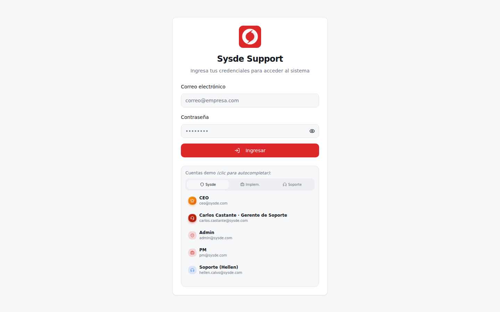

# Registro de cambios — 2026-06-30

Sesión de cierre de gaps del Story Mapping + refactor de roles (RBAC dinámico).
Todo mergeado en `main` vía **PR #2** y desplegado en Vercel. Migraciones aplicadas
en el Supabase de producción (`qorixnxlaiuyxoentrfa`).

> **Nota sobre capturas:** sólo se incluye la del login (pantalla pública). Las
> pantallas autenticadas no se pudieron capturar desde el entorno de la sesión
> porque el navegador headless no alcanza Supabase a través del proxy de egress
> (limitación del entorno; `curl` sí llega, Chromium no). Se pueden capturar
> directamente desde el deploy de Vercel ya en producción.

---

## 1. Login — accesos demo compactos

CEO y "Carlos Castante · Gerente de Soporte" pasaron de tarjeta destacada (hero)
a fila compacta, igualando el tamaño y estilo del resto de cuentas demo.

`src/pages/Login.tsx` — se quitó el flag `featured` de ambas cuentas.

---

## 2. Cierre de gaps del Story Mapping (14 parciales + 9 ausentes)

| id | Cambio | Archivo(s) |
|---|---|---|
| ERP-008 | Editar campos del cliente | `src/components/clients/ClientDetail.tsx` |
| ERP-012 | Catálogo + búsqueda de roles | `src/components/admin/RolesCatalogPanel.tsx`, `src/pages/AdminUsers.tsx` |
| ERP-014 | Roles externos en el catálogo | idem |
| ERP-016 | Búsqueda/filtro de equipos | `src/components/support/SysdeTeamManager.tsx` |
| ERP-029/031/032 | Filtros de tareas por responsable/equipo (incl. calendario) | `src/pages/TasksDashboard.tsx` |
| ERP-030/033 | Filtro "Mis supervisados" (incl. calendario) | `src/pages/TasksDashboard.tsx` |
| ERP-063 | Búsqueda/filtros de contratos | `src/components/clients/ContractsSLATab.tsx` |
| ERP-066 | Asociar paquete facturado a contrato/póliza | `src/components/clients/BilledPackagesTab.tsx` |
| ERP-072 | Estado general consolidado de clientes | `src/components/clients/ClientList.tsx` |
| ERP-084 / PORTAL-013 | Adjuntar archivos a notas de la mesa de discusión | `src/components/support/TicketDetailSheet.tsx`, `src/hooks/useSupportTicketDetails.ts`, migración `20260630120000_note_attachments.sql` |
| ERP-089 | Panel de comentarios pendientes de atender | `src/components/support/PendingCommentsPanel.tsx`, `src/components/support/SupportDashboard.tsx` |
| ERP-109 | Detalle de sesiones de usuario | `src/components/admin/SessionsDetailPanel.tsx`, `src/pages/AdminUsers.tsx` |
| PORTAL-014 | Cambiar contraseña (self-service, portal cliente) | `src/components/auth/ChangePasswordDialog.tsx`, `src/components/dashboard/ClientPortalDashboard.tsx` |

> ERP-020 a 025 (supervisiones) ya estaban implementadas (`SupervisionsAdminPanel`);
> fue un falso negativo del diagnóstico.

---

## 3. Refactor de roles — RBAC dinámico

### Fase 1 — Catálogo de roles gestionable
- Migración `20260630130000_roles_catalog.sql`: tabla `public.roles` (7 de sistema
  protegidos + personalizados).
- `src/hooks/useRoles.ts` + `RolesCatalogPanel.tsx`: CRUD de roles personalizados.
- Cierra **ERP-013/015** a nivel de gestión.

### Fase 2 — Permisos dinámicos
- Migración `20260630140000_rbac_permissions.sql`: `permissions`, `role_permissions`,
  `user_custom_roles` + funciones `has_permission()` / `get_my_permissions()`.
- `src/hooks/usePermissions.ts`: catálogo, matriz por rol, permisos del usuario,
  asignación de roles personalizados.
- `RBACPermissionsTab.tsx`: matriz de permisos **editable y persistida** (antes estática).
- `RolesCatalogPanel.tsx`: asignación de roles personalizados a usuarios.

### Fase 3 — Bridge RLS (patrón aditivo `has_role(...) OR has_permission('clave')`)
- `20260630150000_rbac_rls_bridge_config.sql` — 10 catálogos de configuración.
- `20260630160000_rbac_rls_bridge_batch2.sql` — task_types, reopen_reasons,
  supervisiones, billed_packages.
- `20260630170000_rbac_rls_bridge_batch3.sql` — datos de cliente (contratos, SLAs,
  contactos, dashboard config, overrides). **Total: 20 tablas.**
- Gating por permiso en el frontend: `ConfigurationHub.tsx` + `AppSidebar.tsx`.

> Backlog (requiere base real para verificar estado final de políticas):
> `quotes`, `support_tickets`, `clients`/`client_financials`/`client_contacts`,
> grupo operativo de `harden_rls_phase2`, `business_rules`, asignaciones cliente/gerente.

---

## 4. Estado de despliegue
- **PR #2** mergeado a `main` (merge commit `76e9ca5`).
- **Vercel**: deploy de producción disparado al mergear.
- **Supabase prod**: las 6 migraciones aplicadas y verificadas (7 roles, 32 permisos,
  61 role_permissions, columnas de adjunto y funciones RBAC presentes; bridge
  `has_permission` confirmado en las políticas).

## 5. Verificación
- `tsc --noEmit` limpio en cada lote.
- Tests: **35/35** (`vitest run`).
- **`vite build`** (producción) OK.

> Diagnóstico detallado y secciones de actualización: `docs/gap-storymapping-all-2026-06-30.md`.
