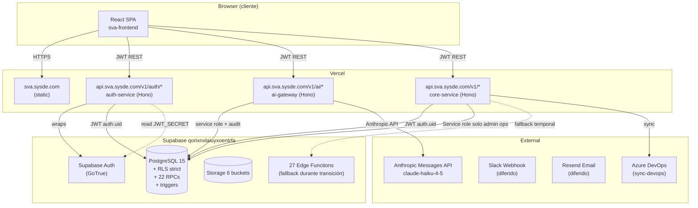

# SVA — Decisiones Arquitectónicas (Fase 2)

**Formato ADR** — Architecture Decision Records

| | |
|---|---|
| **Producido** | 2026-05-14 |
| **Estado** | Borrador — pendiente firma de AWT |
| **Prerequisito** | `01-diagnostico.md` revisado y aprobado |
| **Decisiones tomadas en gate Fase 1 → 2 (por AWT)** | Tickets y Scrum **separados** · Sin dominios adicionales · `send-notification-email` deprecada · Hosting **Vercel** · Urgencia **muy alta** |

---

## 0. Principios rectores derivados del contexto

> Estas decisiones son consistentes entre sí porque parten de los siguientes principios. Si AWT está en desacuerdo con uno, las decisiones aguas abajo cambian.

1. **Pragmatismo > purismo.** El usuario indicó "muy urgente". Esto descarta arquitecturas que tomen 6+ meses (microservicios + Kafka + Kubernetes + Keycloak + database-per-service). El objetivo es **separación frontend/backend en repos distintos en 4-6 semanas, no en 6 meses.**
2. **Strangler Fig, no Big Bang.** Sistema en producción con 29 clientes. Cualquier cambio se hace en paralelo, módulo a módulo. Cero downtime.
3. **Reusar lo que ya funciona.** Postgres Supabase, RLS, Edge Functions, Anthropic API ya migrado. No reescribir lo que no aporta.
4. **El stack debe encajar con el equipo actual.** TypeScript es el lenguaje del frontend. Cualquier opción que requiera onboarding a Go o Java es deuda de hiring que no se justifica para 3 servicios.
5. **Vercel es el hosting confirmado.** Esto **descarta** Kubernetes, descarta API gateways self-hosted, descarta event buses pesados. Vercel tiene constraints concretos (Edge runtime, serverless, cold start, sin sockets persistentes) que dictan trade-offs.

---

## ADR-001 — Servicios mínimos en arranque

**Estado:** Propuesto

### Decisión
Arrancar con **3 servicios** + 1 frontend, no 7-8. Postergar la subdivisión hasta que el primer ciclo esté en producción.

### Opciones evaluadas

| | A — 3 servicios | B — 4 servicios | C — 7 servicios |
|---|---|---|---|
| **Servicios** | Auth · AI Gateway · Core | Auth · AI · Core · Notifications | Auth · Tickets · Scrum · Clients · Team · AI · Notif |
| **Esfuerzo arranque** | 4-6 semanas | 6-8 semanas | 6-12 meses |
| **Operación** | 4 deployables | 5 deployables | 8+ deployables |
| **Riesgo de regression** | Bajo (Core sigue siendo monolito interno) | Medio | Alto |
| **Encaja con urgencia "muy alta"** | ✅ | 🟡 | ❌ |

### Justificación de **A**

- 3 servicios = 3 deployables, 3 contratos API, manejable por 1-3 devs.
- **Auth** y **AI Gateway** son los que tienen contratos MÁS limpios (autenticación es estándar, AI Gateway ya es un proxy hoy). Empezar por ellos = mínimo riesgo de regression sobre lógica de negocio compleja (tickets/scrum/clients).
- **Core** es un "saco" temporal donde vive todo lo demás (Tickets, Scrum, Clients, Team, Reporting). Su API es REST sobre el mismo Postgres. Cuando se estabilice, **se sub-divide en Fase 4 o 5** sin re-arquitectura completa (es solo split de routes).
- Notifications (cuando vuelva a ser prioridad) se separa después como cuarto servicio.

### Riesgo aceptado
"Core" temporalmente concentra mucha lógica. Esto es la deuda explícita del approach Strangler Fig — se paga cuando llegue el momento de sub-dividir.

---

## ADR-002 — Stack del backend

**Estado:** Propuesto

### Decisión
**Hono + TypeScript** ejecutándose en **Vercel Edge Functions** (o Serverless Functions si necesitamos algo que Edge no soporte, como conexiones largas a Postgres).

### Opciones evaluadas

| | Hono + TS | NestJS + TS | Fastify + TS | Go + Echo |
|---|---|---|---|---|
| **Compatibilidad Vercel Edge** | ✅ first-class (Hono fue diseñado para Edge runtimes) | ❌ requiere Node runtime, no Edge | ✅ Node serverless | ❌ no en Vercel |
| **Mismo lenguaje que frontend** | ✅ TS | ✅ TS | ✅ TS | ❌ Go |
| **Curva de aprendizaje vs equipo** | Baja (similar a Express) | Alta (DI containers, decoradores, conceptos opinados) | Baja | Media-Alta |
| **Bundle size / cold start** | Excelente (1-2 KB runtime) | Pesado (Reflect, decorators, ~10 MB) | Bueno | N/A |
| **Ecosistema OpenAPI** | `@hono/zod-openapi` (idiomático) | `@nestjs/swagger` (decoradores) | `@fastify/swagger` | swag |
| **Madurez en producción** | 2024+, en uso por Cloudflare, Vercel | Maduro desde 2018 | Maduro | Maduro |
| **Velocidad de delivery 3 servicios** | ✅ Alta | 🟡 Media (más boilerplate inicial) | ✅ Alta | 🟡 (otro lenguaje en stack) |

### Justificación de Hono

- **Vercel Edge nativo:** ya tenemos `sysdesupport.com` en Vercel. Deploy es `git push`. Cero infraestructura nueva.
- **TypeScript end-to-end:** mismo lenguaje, mismos tipos compartibles vía `packages/shared` en monorepo. Zero context switch para los devs.
- **OpenAPI nativo con Zod:** `@hono/zod-openapi` genera spec automáticamente desde los validators. Esto es **crítico** para el frontend autogenerado y para SDD (Spec-Driven Development) — el contrato es el código.
- **Cold start ~50ms** vs ~500ms+ de NestJS en serverless. En urgencia con tráfico bajo (30 usuarios), esto es la diferencia entre "instantáneo" y "lento".
- **API idiomática parecida a Express:** si un dev del equipo conoce Express, puede ser productivo en Hono en 1 día.

### Por qué NO NestJS
NestJS es excelente cuando hay 5+ devs y se necesita estructura impuesta (DI, módulos, guards). Para 1-3 devs y 3 servicios, **el overhead de boilerplate supera el beneficio**. Además, NestJS no corre en Vercel Edge — requeriría Node serverless o un VM, perdiendo la ventaja de Vercel.

### Por qué NO Go / Python
Go añade un segundo lenguaje al stack. Python tiene su lugar para servicios ML pesados, pero aquí los LLMs viven detrás de Anthropic API — no necesitamos Python. Ambos suman costo de mantenimiento sin beneficio.

---

## ADR-003 — Comunicación entre servicios

**Estado:** Propuesto

### Decisión

**Síncrono:** REST + OpenAPI 3.1, JWT Bearer auth en cada request.

**Asíncrono:** **NO al inicio.** Si necesitamos eventos (notificaciones, audit fan-out), usamos **Postgres `LISTEN/NOTIFY` + Supabase Realtime** o **Vercel Cron** para polling. **Sin event bus dedicado en Fase 2.**

### Opciones evaluadas

#### Síncrono

| | REST + OpenAPI | gRPC | GraphQL Federation |
|---|---|---|---|
| **Browser-friendly** | ✅ | ❌ (necesita gRPC-Web proxy) | ✅ |
| **Servidor-a-servidor performante** | Bueno | Excelente | Bueno |
| **Tooling Vercel** | Nativo | Limitado | Vía Apollo |
| **Genera client TS autogenerado** | ✅ con OpenAPI Generator | ✅ con buf | ✅ con codegen |
| **Versioning** | URL versioning `/v1/`, `/v2/` | proto packages | schema versioning complicado |
| **Curva** | Baja | Alta (proto, codegen pipeline) | Media |
| **Adecuado para 3 servicios + 1 frontend** | ✅ | 🟡 (overkill) | ❌ (overkill agresivo) |

**Justificación:** REST + OpenAPI es el estándar. gRPC es interesante si tuviéramos 20 servicios con tráfico interno alto. Aquí no aplica.

#### Asíncrono

| | RabbitMQ | Kafka | Redis Streams | SNS/SQS | LISTEN/NOTIFY + Vercel Cron |
|---|---|---|---|---|---|
| **Infraestructura nueva** | ✅ self-host | ✅ self-host pesado | ✅ Upstash managed | ✅ AWS | ❌ ya tenemos Postgres |
| **Costo mensual** | $20-50 | $80-200 | $10-30 | Pay-per-use | $0 |
| **Complejidad operativa** | Media | Alta | Baja | Baja | Mínima |
| **Persistencia / replay** | ✅ | ✅ | ✅ (limitado) | ✅ | Limitada |

**Justificación:** En Fase 2 **no necesitamos event bus dedicado**. Lo que hoy llamamos "notificaciones" se invocan client-side y se perdieron al cerrar tab. Lo siguiente más resiliente que cuesta $0 es:

- **`pg_notify` desde un trigger** + un edge function que hace `LISTEN` (vía Supabase Realtime channels — que hoy no usamos).
- O **Vercel Cron** que polea `client_notifications WHERE sent_at IS NULL` cada N minutos.

Cuando el volumen crezca y necesitemos garantía at-least-once con reintentos, evaluamos Upstash Redis Streams (managed, cero ops).

### Versioning de APIs
- URL versioning: `https://api.sva.sysde.com/v1/tickets`, `/v2/tickets`.
- Una versión major puede coexistir con la anterior durante 60 días mínimo antes de deprecar.
- Breaking changes requieren bump major (`/v1/` → `/v2/`).

---

## ADR-004 — Base de datos

**Estado:** Propuesto

### Decisión

**Postgres único compartido** (el actual de Supabase `qorixnxlaiuyxoentrfa`). **NO** database-per-service por ahora. Eventual migración a schemas separados (`auth.*`, `tickets.*`, `scrum.*`) si hace falta aislamiento más adelante.

### Opciones evaluadas

| | Database per service | Schemas separados en mismo Postgres | Shared schema (lo actual) |
|---|---|---|---|
| **Aislamiento** | Total | Lógico (RLS + GRANT) | Mínimo |
| **JOIN entre dominios** | Imposible (debe hacerse via API) | Posible con cuidado | Trivial |
| **Migraciones** | Independientes | Independientes con orden | Centralizadas (hoy) |
| **Costo Supabase** | 4 proyectos = 4× | 1 proyecto | 1 proyecto (hoy) |
| **Complejidad operativa** | Alta (4 backups, 4 monitorings) | Media | Baja |
| **Encaja urgencia** | ❌ | 🟡 (transición gradual) | ✅ |

### Justificación

- **El SVA opera bien hoy** con Postgres único. No hay problema de scaling de DB.
- **Database per service** introduce el problema de transacciones distribuidas (saga pattern) para operaciones cross-context, ej. "crear ticket → asignar a colaborador → registrar audit". No vamos a resolver ese problema ahora.
- **Schemas separados** es la evolución natural cuando el monolito empieza a crecer: cada servicio tiene SU schema, cada migración vive en SU repo, los servicios solo pueden tocar SUS tablas vía `GRANT`. Esta migración se puede hacer en **Fase 4 o 5** sin re-arquitectura.

### Lo que cambia en Fase 2
- **Frontend deja de hacer `supabase.from()` directo.** Pasa a `fetch("https://api.sva.sysde.com/v1/tickets")`.
- **Backend recibe el JWT del usuario, lo pasa a Postgres en headers, y RLS sigue funcionando.** Esto preserva la autorización existente sin reescribirla.
- **Edge Functions actuales se mueven a `core-service`** (o se mantienen en Supabase con redirect desde el backend nuevo, durante la transición).

---

## ADR-005 — Auth e Identity Provider

**Estado:** Propuesto

### Decisión

**Mantener Supabase Auth como IDP.** Crear `auth-service` (Hono) como wrapper que expone:
- `POST /v1/auth/login` → llama internamente a Supabase Auth.
- `GET /v1/auth/me` → devuelve user + rol + assignments.
- `POST /v1/auth/users/*` (admin) → reemplaza `manage-users` edge function.
- Middleware `requireAuth`, `requireRole(...)` exportable como librería para los otros servicios.

### Opciones evaluadas

| | Supabase Auth + wrapper | Auth0 / Clerk | Keycloak self-hosted |
|---|---|---|---|
| **Migración de los 30 usuarios actuales** | Cero (siguen donde están) | Reset masivo de contraseñas | Re-importación |
| **Costo / mes** | Incluido en Supabase | $50-300+ | Server + ops |
| **SSO con clientes B2B** | Limitado | ✅ enterprise | ✅ |
| **Time to working** | 1-2 semanas | 2-4 semanas | 4-8 semanas |
| **Adecuado urgencia** | ✅ | 🟡 | ❌ |

### Justificación
- Cero downtime / cero re-onboarding de los 30 usuarios actuales.
- Supabase Auth es GoTrue (open source, portable más adelante si hace falta).
- Hoy no hay requirement de SSO empresarial — SYSDE usa email/password.
- El `auth-service` es un wrapper que **adelanta** la portabilidad: si en 12 meses queremos migrar a Auth0, solo cambia internamente, los demás servicios siguen llamando al mismo wrapper.

### Implicación clave
**Reimplementar `has_role()`, `is_staff_user()`, `user_can_see_client()` como código TypeScript** del `auth-service`, expuesto vía endpoints + librería compartida. La RLS sigue siendo segunda línea, pero la autorización **primaria** pasa a vivir en código.

---

## ADR-006 — API Gateway

**Estado:** Propuesto

### Decisión

**Sin gateway dedicado al inicio.** Usar **Vercel rewrites + dominios subdominados**:

```
sva.sysde.com           → frontend
api.sva.sysde.com/v1/auth/*       → auth-service
api.sva.sysde.com/v1/ai/*         → ai-gateway
api.sva.sysde.com/v1/*            → core-service (catch-all)
```

Vercel maneja TLS, rate limiting básico, geo-routing, cache de respuestas inmutables, CORS por configuración.

### Opciones evaluadas

| | Vercel rewrites | Kong self-host | AWS API Gateway / Azure APIM |
|---|---|---|---|
| **Costo arranque** | $0 | Servidor + ops | $$ (per-request) |
| **TLS / cert mgmt** | Auto | Manual / Let's Encrypt | Auto |
| **Rate limiting** | Básico (Vercel Pro) | Avanzado | Avanzado |
| **Observabilidad** | Vercel Analytics | Manual | CloudWatch / Application Insights |
| **JWT validation centralizada** | ❌ (cada servicio) | ✅ | ✅ |
| **Migration cost si crece** | Bajo (rutas-only, podemos meter Kong después) | Ya está | Ya está |

### Justificación

- Equipo pequeño. Cero ops para gateway al arranque.
- JWT validation se hace en cada servicio (con la librería compartida `@sva/auth-middleware`). Es duplicación leve pero a esta escala no duele.
- Si el volumen crece a punto de necesitar rate limiting avanzado o WAF, **se introduce Kong/Cloudflare WAF en Fase 5** sin cambiar los servicios.

---

## ADR-007 — Hosting

**Estado:** Propuesto (confirmado por AWT en gate Fase 1)

### Decisión

**Vercel** para frontend y backend. Postgres se mantiene en **Supabase managed**.

### Topología

```
┌─────────────────┐
│   Browser       │
└────────┬────────┘
         │ HTTPS
         ▼
┌─────────────────┐         ┌──────────────────────────────────┐
│ Vercel CDN      │         │ Vercel (separate project)        │
│ sva.sysde.com   │  REST   │ api.sva.sysde.com                │
│ React SPA       │────────▶│ ┌─────────┐ ┌──────────┐ ┌──────┐│
│ (Vite build)    │  JWT    │ │  auth   │ │   ai     │ │ core ││
└─────────────────┘         │ │ service │ │ gateway  │ │service│
                            │ └────┬────┘ └────┬─────┘ └──┬───┘│
                            └──────┼───────────┼──────────┼────┘
                                   │           │          │
                                   ▼           ▼          ▼
                       ┌─────────────────────────────────────┐
                       │ Supabase qorixnxlaiuyxoentrfa        │
                       │ ┌──────────┐ ┌────────┐ ┌──────────┐│
                       │ │ Postgres │ │ Auth   │ │ Storage  ││
                       │ └──────────┘ └────────┘ └──────────┘│
                       │ Edge Functions actuales              │
                       │ (se retiran progresivamente)         │
                       └──────────────────────────────────────┘
```

### Por qué no Azure / AWS
AWT confirmó: "no hay restricción, esto es interno, puede estar en Vercel". No tiene caso pagar el overhead operativo de Azure cuando el frontend ya funciona en Vercel.

---

## ADR-008 — Repos: polyrepo vs monorepo

**Estado:** Propuesto

### Decisión

**2 repos** (polyrepo a nivel macro), **1 de los repos es monorepo** (a nivel micro):

```
sva-frontend/                          ← repo 1
  src/
  package.json
  vite.config.ts

sva-backend/                           ← repo 2 (monorepo Turborepo)
  apps/
    auth-service/
      src/
      package.json
    ai-gateway/
      src/
      package.json
    core-service/
      src/
      package.json
  packages/
    shared/             ← tipos comunes, errors, supabase client
    auth-middleware/    ← requireAuth, requireRole, canAccessClient
    contracts/          ← OpenAPI specs por servicio
  turbo.json
  package.json (workspaces)
```

### Opciones evaluadas

| | 2 repos (frontend + backend-monorepo) | 4 repos puros | 1 monorepo total (frontend + backend) |
|---|---|---|---|
| **Independencia frontend/backend** | ✅ | ✅ | 🟡 |
| **Compartir tipos frontend↔backend** | Via npm package | Via npm package | Trivial |
| **CI/CD por servicio** | ✅ (Turborepo cache) | ✅ | 🟡 (afecta deploy de todo) |
| **Onboarding nuevo dev** | Clonar 2 repos | Clonar 4+ repos | Clonar 1 repo |
| **Overhead inicial** | Bajo | Alto (CI por repo, dependabot ×4) | Mínimo |
| **Adecuado urgencia** | ✅ | ❌ | 🟡 (acopla deploys) |

### Justificación

- **Backend en monorepo:** comparte código entre los 3 servicios (auth-middleware, error types, Supabase client). Turborepo orquesta builds y caches. CI/CD detecta qué servicio cambió y solo lo redeploy.
- **Frontend separado:** ciclo de deploy independiente, tooling distinto (Vite vs Hono). El frontend importa el client TypeScript autogenerado desde el OpenAPI del backend como un paquete npm (publicado o vía submodule).

### Convenciones obligatorias

- **Conventional Commits** en ambos repos: `feat(auth): ...`, `fix(core/tickets): ...`.
- **Trunk-based development:** branches cortas (<3 días), merge a `main` diario.
- **ADRs:** todos en `sva-backend/docs/adr/NNNN-titulo.md`. Esta carpeta `/docs/sdd-migration/` migra a `sva-backend/docs/migration/` después del cutover.
- **Idioma:** código + commits + docs internos en inglés. Documentos para stakeholders (este) en español.

---

## ADR-009 — Estrategia de RLS durante la transición

**Estado:** Propuesto · **Crítico**

### Decisión

**Cada servicio backend conecta a Postgres usando el JWT del usuario, no `SERVICE_ROLE_KEY`**, salvo en operaciones administrativas explícitas. Esto preserva RLS como segunda línea de defensa.

### Detalle

```ts
// En cada request del servicio
const userJwt = req.headers.authorization?.replace("Bearer ", "");

// Cliente Supabase pinned al user — respeta RLS
const sb = createClient(SUPABASE_URL, SUPABASE_ANON_KEY, {
  global: { headers: { Authorization: `Bearer ${userJwt}` } }
});

// Query: RLS evalúa con auth.uid() del JWT
const { data } = await sb.from("support_tickets").select("*");
// Devuelve SOLO los tickets que el usuario puede ver según RLS
```

**Bypass con `SERVICE_ROLE_KEY` solo en:**
- Background workers (cron jobs).
- Operaciones de admin que ya tenían `requireRole(["admin"])` en código (ej: `manage-users`).
- Procesos batch (sync DevOps).

### Implicación
- La autorización primaria pasa a vivir en código del backend (middleware `requireRole`).
- La RLS sigue siendo guardia de profundidad: si el código falla, la RLS rechaza.
- **No se reescribe la RLS existente.** Se mantiene tal cual.

### Riesgo aceptado
Latencia adicional por el roundtrip JWT validation en cada request. Mitigación: JWT verification es síncrona, O(1), sin DB call (se valida el HMAC localmente con el JWT_SECRET de Supabase).

---

## ADR-010 — Observabilidad mínima desde día 1

**Estado:** Propuesto

### Decisión

- **Logs:** JSON estructurado (`pino`), volcado al stdout de Vercel → Vercel Logs.
- **Tracing:** OpenTelemetry SDK + Vercel OpenTelemetry collector (incluido). Traces visibles en Vercel.
- **Métricas:** Vercel Analytics (incluido) + Web Vitals del frontend.
- **Errores:** Sentry SDK en frontend y backend (free tier hasta 5000 errors/month).
- **Health checks:** cada servicio expone `GET /healthz` y `GET /readyz`.

### Por qué desde día 1
Sin observabilidad, el debug en producción multi-servicio es ciego. El costo de añadir `pino` + Sentry SDK al scaffold inicial es ~30 minutos. Después del primer deploy, agregar tracing retroactivamente es 10× más caro.

---

## ADR-011 — Testing mínimo obligatorio

**Estado:** Propuesto

### Decisión

- **Backend:** mínimo **70% coverage en lógica de dominio** (services, no controllers). Tests unitarios con Vitest.
- **Contract tests:** entre servicios y entre frontend↔backend. OpenAPI spec se versiona en el repo; el frontend usa client autogenerado; cualquier breaking change en el spec rompe build del frontend.
- **E2E:** Playwright en repo del frontend, mínimo 5 flows críticos (login, crear ticket, asignar sprint, dashboard CEO, portal cliente).
- **Migración:** **antes de cutover de cada servicio**, los tests del módulo correspondiente deben estar al 70%.

### Por qué
Actualmente el coverage es ~0% en hooks/components (35 tests todos en `src/lib/`). Migrar a microservicios sin tests es ruleta rusa. El refactor previo recomendado en §5.1 de `01-diagnostico.md` debe incluir cobertura de los hooks que se van a reemplazar.

---

## ADR-012 — Plan de retirada de Edge Functions actuales

**Estado:** Propuesto

### Decisión

Las 27 Edge Functions actuales **no se eliminan** durante la migración. Se **dejan corriendo en Supabase** como fallback durante la transición, y se desactivan función por función cuando su equivalente HTTP esté en `api.sva.sysde.com`.

### Cronograma sugerido (refinable en Fase 4)

| Función | Sigue en Supabase hasta… | Migra a… |
|---|---|---|
| `manage-users` | Cutover de `auth-service` | `auth-service: POST /v1/auth/users/*` |
| Las 17 funciones AI | Cutover de `ai-gateway` | `ai-gateway: POST /v1/ai/*` |
| Las restantes (decrypt-ticket, evaluate-case-compliance, classify-tickets, etc.) | Cutover de `core-service` | `core-service: POST /v1/...` |
| `send-notification-email`, `notify-*` | **Deprecadas inmediatamente** (decisión AWT) | — |
| `reset-passwords` | Ya deprecada (410 Gone) | — |
| `sync-devops` | Sigue en Supabase indefinidamente o migra a `core-service` cuando se priorice | TBD |

---

## Resumen — qué necesitamos firmar antes de Fase 3

| ADR | Decisión | ¿Apruebas? |
|---|---|---|
| 001 | 3 servicios al arranque (Auth + AI Gateway + Core) | ☐ |
| 002 | Hono + TypeScript en Vercel Edge Functions | ☐ |
| 003 | REST + OpenAPI 3.1, sin event bus al inicio | ☐ |
| 004 | Postgres único compartido (mismo Supabase) | ☐ |
| 005 | Supabase Auth como IDP, wrapper `auth-service` encima | ☐ |
| 006 | Sin gateway dedicado, usar Vercel rewrites | ☐ |
| 007 | Hosting Vercel (frontend + 3 servicios separados) | ☐ |
| 008 | 2 repos: `sva-frontend` + `sva-backend` (monorepo Turborepo) | ☐ |
| 009 | JWT del usuario al conectar a Postgres → preserva RLS | ☐ |
| 010 | Observabilidad mínima desde día 1 (pino + Sentry + OTel) | ☐ |
| 011 | Testing 70% coverage en lógica de dominio + contract tests | ☐ |
| 012 | Edge Functions actuales se mantienen como fallback, retiro gradual | ☐ |

---

## Diagrama de la nueva arquitectura (preview de Fase 3)



---

## ✋ Gate Fase 2 → Fase 3 — necesito tu confirmación

Tu prompt original dice: **"No avances a Fase 3 sin que AWT firme las decisiones."**

Tres opciones de respuesta:

### Opción 1 — "Apruebo todo, sigue"
Significa que firmas las 12 ADRs como están. Paso a **Fase 3: Diseño detallado** (diagramas C4 nivel 3, contratos OpenAPI iniciales por servicio, estructura de carpetas exacta de los 2 repos).

### Opción 2 — "Apruebo todo excepto X — cambiémoslo a Y"
Identifica qué ADR(s) ajustar y la razón. Reescribo solo eso, vuelvo a presentar el delta, esperando tu firma final antes de Fase 3.

### Opción 3 — "Necesito que profundices Z antes de firmar"
Si alguna decisión te queda ambigua, dímelo y profundizo en ese ADR específico antes de pedirte firma.

---

## Referencias cruzadas

| Documento | Estado |
|---|---|
| `00-resumen-ejecutivo.md` | Pendiente — se escribe al final |
| `01-diagnostico.md` | ✅ Producido y aprobado por AWT en gate F1→F2 |
| **`02-decisiones-arquitectonicas.md`** | **Este documento** — pendiente firma |
| `03-workflow-agentes.md` (SDD) | Pendiente Fase 3 |
| `04-diagrama-flujo.md` | Pendiente Fase 3 |
| `05-gobernanza-y-reglas.md` | Pendiente Fase 3 |
| `06-plan-adopcion.md` | Pendiente Fase 4 |
| `07-metricas-exito.md` | Pendiente Fase 4 |
| `08-riesgos-y-mitigaciones.md` | Pendiente Fase 4 |

---

*Fin Fase 2. No avanzo a Fase 3 hasta firma de AWT sobre las 12 ADRs.*
