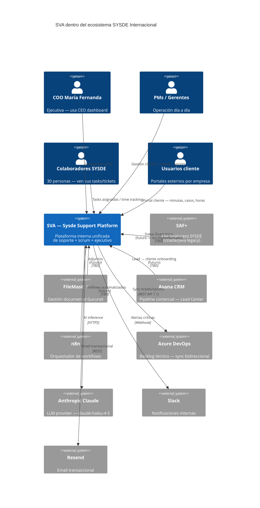
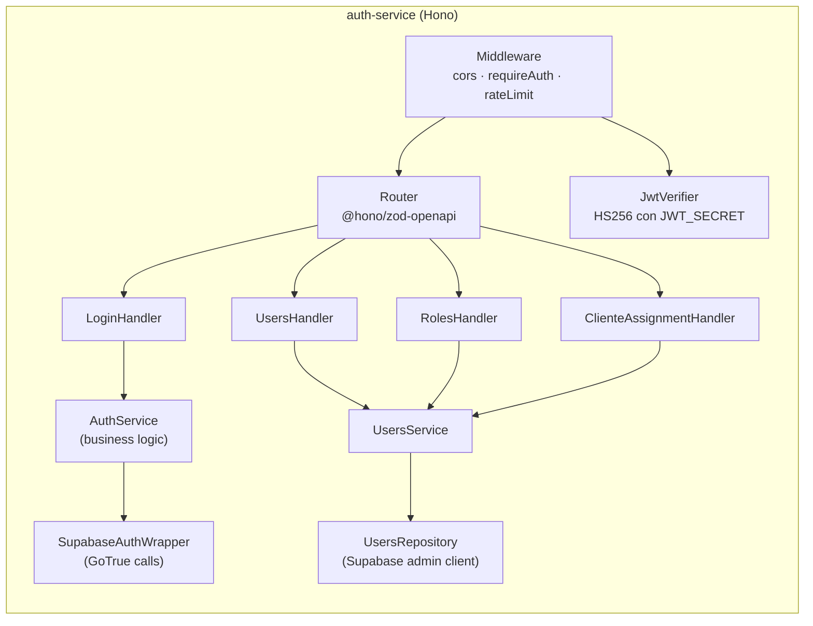
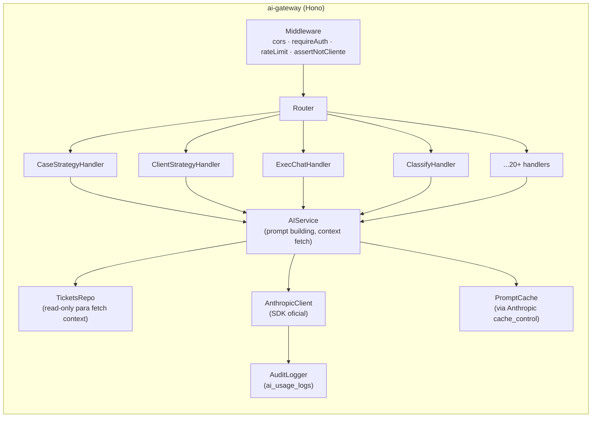
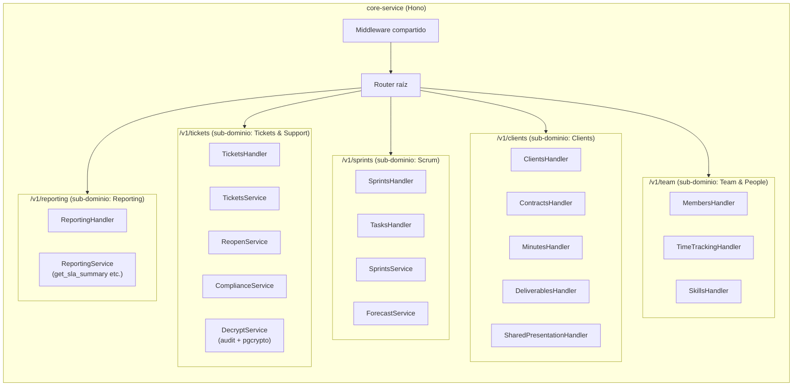

# SVA — Diseño Detallado de la Nueva Arquitectura (Fase 3)

| | |
|---|---|
| **Producido** | 2026-05-14 |
| **Prerequisitos firmados** | `01-diagnostico.md` ✓ · `02-decisiones-arquitectonicas.md` 12/12 ADRs ✓ |
| **Alcance Fase 3** | C4 (niveles 1-3) · Estructura de carpetas exacta · Estándares cross-service · Contratos OpenAPI 3.1 inicial · Catálogo de eventos futuros |
| **Out of scope** | Implementación de servicios (Fase 5) · Cronograma específico de cutover (Fase 4) |

---

## 1. C4 Nivel 1 — Sistema en el ecosistema SYSDE



**Notas:**
- SAF+, FileMaster, Asana CRM, n8n son sistemas del ecosistema SYSDE pero **no tienen integración activa con SVA hoy**. Son candidatos a integraciones futuras vía API REST de los microservicios nuevos.
- La única integración externa **activa** es Anthropic, Slack/Resend (diferida según ADR-012) y Azure DevOps (`sync-devops`).

---

## 2. C4 Nivel 2 — Contenedores

```mermaid
flowchart TB
  subgraph Browser["Browser"]
    UI["React 18 SPA<br/>(sva-frontend repo)<br/>Vite + Tailwind + shadcn"]
  end

  subgraph VercelFrontend["Vercel Project: sva-frontend"]
    CDN["sva.sysde.com<br/>Static assets + SPA"]
  end

  subgraph VercelBackend["Vercel Org: sva-backend (3 projects)"]
    Auth["Vercel Project: auth-service<br/>api.sva.sysde.com/v1/auth/*<br/>Hono + TS — Edge runtime"]
    AI["Vercel Project: ai-gateway<br/>api.sva.sysde.com/v1/ai/*<br/>Hono + TS — Edge runtime"]
    Core["Vercel Project: core-service<br/>api.sva.sysde.com/v1/*<br/>(tickets, sprints, clients, team, reporting)<br/>Hono + TS — Edge runtime"]
  end

  subgraph Supabase["Supabase Cloud: qorixnxlaiuyxoentrfa"]
    DB[("PostgreSQL 15<br/>80+ tables · 98 migrations<br/>22 SQL functions · triggers<br/>RLS strict")]
    SbAuth["Supabase Auth (GoTrue)<br/>JWT issuer · 30 users"]
    Storage[("Storage<br/>6 buckets")]
    Realtime["Realtime channels<br/>(no usado hoy — disponible)"]
    EdgeFns["Edge Functions (27)<br/>FALLBACK durante transición"]
  end

  subgraph External["Servicios externos"]
    Anthropic["Anthropic Messages API<br/>claude-haiku-4-5"]
    SlackEx["Slack Webhook<br/>(diferido)"]
    ResendEx["Resend Email<br/>(diferido)"]
    ADO["Azure DevOps<br/>REST 7.1"]
  end

  subgraph Observability["Observabilidad"]
    Sentry["Sentry<br/>(frontend + 3 servicios)"]
    Vlogs["Vercel Logs + Analytics<br/>OpenTelemetry collector"]
  end

  UI -->|HTTPS static| CDN
  UI -->|Bearer JWT REST| Auth
  UI -->|Bearer JWT REST| AI
  UI -->|Bearer JWT REST| Core

  Auth -->|signInWithPassword<br/>admin.createUser| SbAuth
  Auth -->|JWT del user| DB
  AI -->|service role + audit logs| DB
  AI -->|Messages API| Anthropic
  Core -->|JWT del user (default)| DB
  Core -->|service role (admin ops)| DB
  Core -->|Storage SDK| Storage
  Core -.->|fallback temporal| EdgeFns
  Core -->|sync| ADO

  Auth -.->|error reports| Sentry
  AI -.->|error reports + traces| Sentry
  Core -.->|error reports + traces| Sentry
  UI -.->|error reports + Web Vitals| Sentry
```

### Routing en `api.sva.sysde.com`

Vercel rewrites en un **proyecto edge proxy** (opcional) o **3 dominios separados** + un router en el frontend. Recomiendo subpaths sobre un solo dominio:

```
api.sva.sysde.com/v1/auth/*   → auth-service Vercel project
api.sva.sysde.com/v1/ai/*     → ai-gateway Vercel project
api.sva.sysde.com/v1/*        → core-service Vercel project (catch-all)
```

La forma exacta de implementar este routing en Vercel es:
- **Opción A:** un solo proyecto Vercel `api-router` con `vercel.json` rewrites que apuntan a los 3 servicios. Único punto de entrada, single TLS cert.
- **Opción B:** 3 dominios distintos (`auth.api.sva.sysde.com`, `ai.api.sva.sysde.com`, `core.api.sva.sysde.com`). Más simple operativamente, peor para CORS.

**Recomendación:** Opción A. Costo: 5 minutos de `vercel.json`. Beneficio: el frontend tiene un solo `BASE_URL` para todos los servicios.

---

## 3. C4 Nivel 3 — Componentes internos por servicio

Patrón común de los 3 servicios — capas:

```
[HTTP request] → middleware (cors, requireAuth, rateLimit) → router → handler → service → repository → DB
                                                                                            ↓
                                                                                       [external API si aplica]
```

### 3.1 `auth-service`



**Responsabilidades:**
- Wrapper sobre `supabase.auth.*` (login, signup admin, password reset).
- CRUD de `user_roles` y `cliente_company_assignments` (reemplaza `manage-users` edge fn).
- Middleware exportable como librería NPM-local (`@sva/auth-middleware`) consumida por `ai-gateway` y `core-service`.
- Endpoint `GET /v1/auth/me` — devuelve user + best-role + clienteAssignment (reemplaza lo que hoy hace `useAuth.tsx:49-86`).

### 3.2 `ai-gateway`



**Responsabilidades:**
- Reemplaza las 17 edge functions IA con un solo servicio.
- Llama a Anthropic `claude-haiku-4-5` (con override por endpoint si hace falta Sonnet/Opus).
- Prompt caching automático en system prompts ≥ 4096 tokens (ya implementado en `_shared/cors.ts`).
- Rate limit por user y por endpoint (ej: case-strategy: 10 req/hr/user; executive-chat: 50 req/hr/user).
- Logging exhaustivo a `ai_usage_logs` (cada call: function_name, model, tokens, latency, user_id, redacted).
- **NO almacena state.** Es stateless gateway.

### 3.3 `core-service`

Es el servicio "saco" temporal según ADR-001. Internamente tiene **subdominios** que serán los futuros microservicios cuando se sub-divida:



**Cada subdominio vive en su propia carpeta** (`apps/core-service/src/modules/tickets/`, etc.), con su propio Router, Service, Repository y tests. Cuando se sub-divida en Fase 4 o 5, **se copia la carpeta a `apps/tickets-service/`** y se ajustan los imports.

---

## 4. Estructura de carpetas exacta

### 4.1 Repo `sva-frontend`

```
sva-frontend/
├── .github/
│   └── workflows/
│       └── ci.yml                    # tsc + vitest + playwright
├── public/
│   ├── favicon.ico
│   └── ...
├── src/
│   ├── main.tsx
│   ├── App.tsx                       # Router + providers
│   ├── pages/                        # Páginas (12 actuales, mismas)
│   ├── components/                   # UI components (200+)
│   ├── hooks/                        # Hooks — AHORA llaman al backend (no Supabase directo)
│   │   ├── useAuth.tsx               # → llama auth-service /v1/auth/*
│   │   ├── useSupportTickets.ts      # → llama core-service /v1/tickets/*
│   │   ├── useTeamScrum.ts           # → core-service /v1/sprints/*
│   │   └── ...
│   ├── lib/
│   │   ├── api/                      # ← NUEVO
│   │   │   ├── client.ts             # HTTP client (fetch wrapper con auth)
│   │   │   ├── generated/            # OpenAPI client autogenerado
│   │   │   │   ├── auth/             # client de auth-service
│   │   │   │   ├── ai/               # client de ai-gateway
│   │   │   │   └── core/             # client de core-service
│   │   │   └── errors.ts             # ApiError, mapeo HTTP→ApiError
│   │   ├── ticketStatus.ts           # mantiene
│   │   ├── exportCsv.ts              # mantiene
│   │   └── utils.ts
│   ├── integrations/
│   │   └── supabase/                 # ← solo Auth + Storage durante transición
│   │       └── client.ts             # supabase.auth.* + supabase.storage.*
│   └── types/
│       └── api.ts                    # tipos compartidos (re-export de api/generated)
├── tests/
│   └── e2e/                          # ← NUEVO: Playwright
│       ├── login.spec.ts
│       ├── create-ticket.spec.ts
│       ├── client-portal.spec.ts
│       ├── ceo-dashboard.spec.ts
│       └── scrum-flow.spec.ts
├── .env.example                      # VITE_API_BASE_URL, VITE_SUPABASE_URL (auth+storage)
├── package.json
├── vite.config.ts
├── vitest.config.ts
├── playwright.config.ts              # ← NUEVO
├── tsconfig.json
├── tailwind.config.ts
├── eslint.config.js
└── README.md
```

**Clave:** la carpeta `src/lib/api/generated/` se genera desde los OpenAPI YAMLs del backend con `openapi-typescript` u `openapi-generator-cli`. Cualquier cambio en los specs del backend → regenera → falla TS si hay breaking change. **Esto es el contract test natural.**

### 4.2 Repo `sva-backend` (monorepo Turborepo)

```
sva-backend/
├── .github/
│   └── workflows/
│       ├── ci.yml                    # tsc + vitest + contract tests por app
│       └── deploy.yml                # turbo deploy (Vercel CLI por app)
├── apps/
│   ├── auth-service/
│   │   ├── src/
│   │   │   ├── index.ts              # Hono app entry
│   │   │   ├── routes/
│   │   │   │   ├── login.ts
│   │   │   │   ├── me.ts
│   │   │   │   ├── users.ts
│   │   │   │   ├── roles.ts
│   │   │   │   └── cliente-assignments.ts
│   │   │   ├── services/
│   │   │   │   ├── auth.service.ts
│   │   │   │   └── users.service.ts
│   │   │   ├── repositories/
│   │   │   │   └── users.repository.ts
│   │   │   └── lib/
│   │   │       └── supabase-admin.ts
│   │   ├── tests/
│   │   ├── package.json
│   │   ├── tsconfig.json
│   │   ├── vercel.json
│   │   └── README.md
│   │
│   ├── ai-gateway/
│   │   ├── src/
│   │   │   ├── index.ts
│   │   │   ├── routes/
│   │   │   │   ├── case-strategy.ts
│   │   │   │   ├── client-strategy.ts
│   │   │   │   ├── exec-chat.ts
│   │   │   │   ├── classify.ts
│   │   │   │   └── ... (17 endpoints total)
│   │   │   ├── services/
│   │   │   │   └── ai.service.ts
│   │   │   ├── lib/
│   │   │   │   ├── anthropic-client.ts
│   │   │   │   ├── prompt-cache.ts
│   │   │   │   └── audit-logger.ts
│   │   │   └── prompts/              # System prompts versionados
│   │   │       ├── case-strategy.txt
│   │   │       ├── exec-chat.txt
│   │   │       └── ...
│   │   ├── tests/
│   │   └── ...
│   │
│   └── core-service/
│       ├── src/
│       │   ├── index.ts
│       │   ├── modules/
│       │   │   ├── tickets/
│       │   │   │   ├── tickets.routes.ts
│       │   │   │   ├── tickets.service.ts
│       │   │   │   ├── tickets.repository.ts
│       │   │   │   ├── reopens.service.ts
│       │   │   │   ├── compliance.service.ts
│       │   │   │   ├── decrypt.service.ts
│       │   │   │   └── tickets.schemas.ts   # Zod schemas
│       │   │   ├── sprints/
│       │   │   ├── clients/
│       │   │   ├── team/
│       │   │   └── reporting/
│       │   └── lib/
│       │       └── supabase.ts
│       ├── tests/
│       └── ...
│
├── packages/
│   ├── shared/                       # tipos comunes, error types
│   │   ├── src/
│   │   │   ├── errors.ts             # ApiError, AuthError, NotFoundError, etc.
│   │   │   ├── types.ts              # Role, Permission, Visibility
│   │   │   └── constants.ts          # estados ticket, prioridades
│   │   ├── package.json
│   │   └── tsconfig.json
│   │
│   ├── auth-middleware/              # consumido por ai-gateway + core-service
│   │   ├── src/
│   │   │   ├── index.ts
│   │   │   ├── jwt-verifier.ts
│   │   │   ├── require-auth.ts
│   │   │   ├── require-role.ts
│   │   │   └── can-access-client.ts
│   │   └── package.json
│   │
│   └── contracts/                    # OpenAPI specs (también acá para co-versionado)
│       ├── auth-service.openapi.yaml
│       ├── ai-gateway.openapi.yaml
│       └── core-service.openapi.yaml
│
├── docs/
│   ├── adr/                          # ADRs (las 12 actuales migran acá)
│   │   ├── 0001-three-services-at-start.md
│   │   ├── 0002-hono-typescript-stack.md
│   │   └── ...
│   ├── runbooks/                     # Operación día a día
│   │   ├── deploy.md
│   │   ├── rollback.md
│   │   └── on-call.md
│   └── architecture/                 # diagrams C4 + decisions
│
├── turbo.json
├── package.json                      # workspaces: apps/* packages/*
├── tsconfig.base.json
├── .env.example                      # SUPABASE_URL, SUPABASE_SERVICE_ROLE_KEY, ANTHROPIC_API_KEY, etc.
└── README.md
```

**Convenciones:**
- `apps/` = deployables.
- `packages/` = shared libraries (consumidas vía workspace import).
- `contracts/` co-versionado con código — un PR que cambia OpenAPI también incluye la implementación.
- `prompts/` para AI = archivos `.txt` versionados (no hardcoded en TS) — facilita iterar prompts sin redeploy si se carga vía Vercel KV o similar más adelante.

---

## 5. Estándares cross-service

### 5.1 Autenticación HTTP

```
Authorization: Bearer <JWT-Supabase>
```

- Validado en cada servicio por `@sva/auth-middleware` (verifica HMAC HS256 con `SUPABASE_JWT_SECRET`).
- JWT payload incluye: `sub` (user_id), `email`, `role` (mejor rol del user — duplicado en `app_metadata` por trigger).
- Si falta o inválido → `401`.
- Si rol insuficiente para el endpoint → `403`.

### 5.2 Códigos de error estandarizados

Todos los servicios devuelven errores con shape consistente:

```json
{
  "error": {
    "code": "TICKET_NOT_FOUND",
    "message": "Ticket with id 'xxx' not found",
    "details": { "ticket_id": "xxx" },
    "request_id": "req_01HXX..."
  }
}
```

**Códigos estándar:**

| HTTP | Code | Cuándo |
|---|---|---|
| 400 | `INVALID_REQUEST` | Body inválido (Zod fail) |
| 400 | `INVALID_TRANSITION` | Estado de ticket no permite transición (ej: CERRADA → APROBADA) |
| 401 | `UNAUTHORIZED` | JWT ausente o inválido |
| 403 | `FORBIDDEN_ROLE` | Rol no autorizado |
| 403 | `FORBIDDEN_SCOPE` | Cliente no asignado al usuario |
| 404 | `NOT_FOUND` | Recurso no existe (o usuario no puede verlo) |
| 409 | `CONFLICT` | Estado actual incompatible (ej: ya cerrado) |
| 422 | `BUSINESS_RULE_VIOLATION` | Falla regla de negocio (ej: SLA exceeded) |
| 429 | `RATE_LIMITED` | Excedido (header `Retry-After`) |
| 500 | `INTERNAL_ERROR` | Bug — alertado a Sentry |
| 502 | `UPSTREAM_ERROR` | Anthropic/DevOps/Resend falló — reintentable |

### 5.3 Rate limiting

Implementado por servicio, no en gateway. Estrategia:

| Servicio | Endpoint | Limit | Window |
|---|---|---|---|
| auth-service | `POST /v1/auth/login` | 10 | 5 min |
| auth-service | `POST /v1/auth/users` | 20 | 1 min |
| ai-gateway | `POST /v1/ai/case-strategy` | 10 | 1 hr |
| ai-gateway | `POST /v1/ai/exec-chat` | 50 | 1 hr |
| ai-gateway | `POST /v1/ai/classify-tickets` | 5 | 1 hr |
| core-service | `* /v1/tickets/*` | 300 | 1 min |
| core-service | `* /v1/*` (default) | 200 | 1 min |

Almacenamiento: **Upstash Redis** (managed, free tier 10k cmd/day suficiente) o **Vercel KV**. Decidir en Fase 5.

### 5.4 Headers estándar

| Header | Dirección | Propósito |
|---|---|---|
| `Authorization: Bearer <jwt>` | request | Auth (todos los endpoints excepto `/healthz`, `/v1/auth/login`) |
| `Content-Type: application/json` | request/response | Default |
| `X-Request-Id: req_01H...` | response | Trace ID — propagado a Sentry/logs |
| `X-Idempotency-Key: <uuid>` | request | Mutations idempotentes (POST/PUT/DELETE) |
| `Retry-After: <seconds>` | response 429 | Backoff hint |
| `X-RateLimit-Limit / Remaining / Reset` | response | Quota status |
| `Sentry-Trace` | request/response | Tracing distribuido |
| `Access-Control-Allow-Origin` | response | CORS (lista blanca: sva.sysde.com + localhost) |

### 5.5 CORS

```ts
// Aplicar en cada Hono app
import { cors } from "hono/cors";

app.use("*", cors({
  origin: (origin) => {
    const allowed = (Deno.env.get("ALLOWED_ORIGINS") ?? "").split(",");
    if (allowed.includes(origin)) return origin;
    if (process.env.NODE_ENV === "development" && origin.startsWith("http://localhost")) return origin;
    return null;
  },
  credentials: false,  // JWT en Authorization header, no cookies
  allowMethods: ["GET", "POST", "PATCH", "DELETE", "OPTIONS"],
  allowHeaders: ["Authorization", "Content-Type", "X-Request-Id", "X-Idempotency-Key"],
  exposeHeaders: ["X-Request-Id", "X-RateLimit-Limit", "X-RateLimit-Remaining", "X-RateLimit-Reset", "Retry-After"],
}));
```

### 5.6 Versioning de APIs

- **URL versioning:** `/v1/`, `/v2/`.
- **Breaking change** = bump major (`/v1/tickets` → `/v2/tickets`).
- Una vez deprecada una versión, **mantener viva mínimo 60 días** con header `Deprecation: true` y `Sunset: <ISO date>`.
- Cambios no-breaking (campos opcionales nuevos, nuevos endpoints) → mismo `/v1/`.

### 5.7 Idempotencia en mutations

POST/PUT/DELETE críticos aceptan header `X-Idempotency-Key: <uuid>`. El servidor cachea response por 24h:
- Si mismo key + mismo body + dentro de 24h → devuelve response cacheada (200, no re-ejecuta).
- Si mismo key + body distinto → 409 `IDEMPOTENCY_CONFLICT`.

**Aplicable a:** `POST /v1/tickets`, `POST /v1/auth/users`, `POST /v1/ai/*` (las de IA son costosas — idempotencia salva $$).

Almacenamiento de keys: Upstash Redis con TTL.

### 5.8 Convenciones de naming

| Tipo | Convención | Ejemplo |
|---|---|---|
| URL paths | `kebab-case`, plural | `/v1/support-tickets/{id}/reopens` |
| JSON keys (request/response) | `snake_case` (mantiene compat con BD) | `{ ticket_id, client_id, fecha_registro }` |
| Header names | `Title-Case` con guiones | `X-Request-Id`, `X-Idempotency-Key` |
| Schema names en OpenAPI | `PascalCase` | `Ticket`, `SupportSprintCreate` |
| Error codes | `UPPER_SNAKE_CASE` | `TICKET_NOT_FOUND` |

> ⚠️ **JSON keys en `snake_case`** intencionalmente, no `camelCase`. Razón: las tablas Postgres usan `snake_case` y los hooks actuales esperan ese shape. Cambiar a `camelCase` rompería 80 archivos. Mantenemos consistencia con la BD.

---

## 6. Catálogo de endpoints (resumen por servicio)

> Detalles completos en los archivos `contracts/<servicio>/openapi.yaml`.

### 6.1 `auth-service` — 10 endpoints

| Método | Path | Auth | Propósito |
|---|---|---|---|
| POST | `/v1/auth/login` | Anónimo | Email + password → JWT |
| POST | `/v1/auth/refresh` | Refresh token | Renovar JWT |
| POST | `/v1/auth/logout` | Bearer | Invalidar session |
| GET | `/v1/auth/me` | Bearer | User + role + cliente_assignment |
| POST | `/v1/auth/users` | Bearer admin | Crear user staff |
| PATCH | `/v1/auth/users/{id}` | Bearer admin | Actualizar (role, email, password) |
| DELETE | `/v1/auth/users/{id}` | Bearer admin | Soft delete user |
| POST | `/v1/auth/cliente-users` | Bearer admin/pm | Crear user cliente + assignment |
| GET | `/v1/auth/cliente-users` | Bearer admin/pm | Listar users de un cliente |
| DELETE | `/v1/auth/cliente-assignments/{user_id}/{client_id}` | Bearer admin/pm | Revocar asignación |

### 6.2 `ai-gateway` — 20 endpoints

Todos `POST`, todos `Bearer` con role check, todos retornan `{ result, usage, model }`:

| Path | Reemplaza edge fn | Role |
|---|---|---|
| `/v1/ai/case-strategy` | `case-strategy-ai` | admin/pm/gerente/colaborador |
| `/v1/ai/client-strategy` | `client-strategy-ai` | admin/pm/gerente |
| `/v1/ai/exec-chat` | `executive-ai-chat` | admin/pm/gerente/colaborador |
| `/v1/ai/classify-tickets` | `classify-tickets` | admin/pm/gerente |
| `/v1/ai/evaluate-compliance` | `evaluate-case-compliance` | admin/pm/gerente |
| `/v1/ai/policy-assistant` | `policy-ai-assistant` | admin/pm/gerente |
| `/v1/ai/forecast-sprint` | `forecast-sprint` | admin/pm/gerente |
| `/v1/ai/pm-analysis` | `pm-ai-analysis` | admin/pm/gerente |
| `/v1/ai/sva-strategy` | `sva-strategy` | admin/pm/gerente |
| `/v1/ai/summarize-transcript` | `summarize-transcript` | authenticated |
| `/v1/ai/parse-time-entry` | `parse-time-entry` | authenticated |
| `/v1/ai/recommend-team` | `recommend-team-for-client` | admin/pm/gerente |
| `/v1/ai/analyze-team-scrum` | `analyze-team-scrum` | admin/pm/gerente |
| `/v1/ai/analyze-team-level` | `analyze-team-level` | admin/pm/gerente |
| `/v1/ai/analyze-team-activity` | `analyze-team-activity` | self or admin |
| `/v1/ai/analyze-cv` | `analyze-cv` | self or admin |
| `/v1/ai/analyze-career-path` | `analyze-career-path` | self or admin |
| `/v1/ai/member-chat` | `member-agent-chat` | self or admin |
| `/v1/ai/member-digest` | `member-agent-weekly-digest` | self or admin |
| `/v1/ai/mentor` | `mentor-ai` | authenticated |

### 6.3 `core-service` — ~40 endpoints distribuidos

#### Subdominio `/v1/tickets/*` (Tickets & Support)
- `GET /v1/tickets` — list con filtros (client_id, estado, responsable, sla_status)
- `POST /v1/tickets` — crear (genera consecutivos vía trigger)
- `GET /v1/tickets/{id}` — detalle
- `PATCH /v1/tickets/{id}` — actualizar (estado, asignación, etc.)
- `DELETE /v1/tickets/{id}` — admin only
- `POST /v1/tickets/{id}/reopen` — reapertura (requiere reason + type)
- `GET /v1/tickets/{id}/reopens` — historial reincidencias
- `GET /v1/tickets/{id}/subtasks` / `POST` / `PATCH` / `DELETE`
- `GET /v1/tickets/{id}/notes` / `POST`
- `GET /v1/tickets/{id}/attachments` / `POST` / `DELETE`
- `POST /v1/tickets/{id}/decrypt` — descifra confidencial (admin/pm only, audit)
- `GET /v1/tickets/sla-summary` — RPC `get_sla_summary`
- `GET /v1/tickets/sla-status` — RPC `get_tickets_sla_status`
- `GET /v1/tickets/reopens-summary` — view `support_reopens_summary`

#### Subdominio `/v1/sprints/*` (Scrum)
- `GET /v1/sprints?client_id=X`
- `POST /v1/sprints` / `PATCH /v1/sprints/{id}`
- `GET /v1/sprints/{id}/tasks` / `POST`
- `PATCH /v1/tasks/{id}` (mover entre sprints, asignar, etc.)
- `POST /v1/sprints/{id}/start` / `POST /v1/sprints/{id}/complete`

#### Subdominio `/v1/clients/*` (Clients)
- `GET /v1/clients` / `POST` / `GET /v1/clients/{id}` / `PATCH` / `DELETE`
- `GET /v1/clients/{id}/contracts` / `POST`
- `GET /v1/clients/{id}/minutes` / `POST`
- `GET /v1/clients/{id}/deliverables` / `POST`
- `GET /v1/clients/{id}/financials`
- `POST /v1/clients/{id}/share` — genera token público para SharedPresentation

#### Subdominio `/v1/team/*` (Team & People)
- `GET /v1/team/members` / `GET /v1/team/members/{id}`
- `GET /v1/team/members/{id}/skills` / `POST`
- `GET /v1/team/time-entries?member_id=X&week=W`
- `POST /v1/team/time-entries`

#### Subdominio `/v1/reporting/*` (Reporting)
- `GET /v1/reporting/executive-summary`
- `GET /v1/reporting/ai-usage`
- `GET /v1/reporting/portfolio-health`

### 6.4 Endpoints públicos sin auth (con token)

| Método | Path | Servicio | Propósito |
|---|---|---|---|
| GET | `/v1/public/presentations/{token}` | core-service | Vista anónima de minuta cliente |
| GET | `/v1/public/support-presentations/{token}` | core-service | Vista anónima de presentación soporte |
| GET | `/v1/public/ticket-history/{token}` | core-service | Historial público de un ticket |
| POST | `/v1/public/ticket-history/{token}/view` | core-service | Bump view counter (reemplaza RPC) |

> Estos endpoints están separados intencionalmente bajo `/v1/public/*` para que el middleware de auth sepa que no aplica.

---

## 7. Catálogo de eventos (a futuro)

> Por ADR-003 **no hay event bus en Fase 2**. Este catálogo define los eventos que existirán **cuando** se introduzca event bus (Fase 5+), para que los servicios estén diseñados con la intención correcta desde el inicio.

### Productores y consumidores

| Evento | Productor | Consumidores futuros | Schema versión |
|---|---|---|---|
| `user.created.v1` | auth-service | notifications-service, core-service | v1 |
| `user.role_changed.v1` | auth-service | core-service (invalidar cache) | v1 |
| `cliente_assignment.changed.v1` | auth-service | core-service | v1 |
| `ticket.created.v1` | core-service | notifications-service (slack/email), ai-gateway (auto-classify) | v1 |
| `ticket.status_changed.v1` | core-service | notifications-service | v1 |
| `ticket.reopened.v1` | core-service | notifications-service (slack si ≥3) | v1 |
| `ticket.assigned.v1` | core-service | notifications-service | v1 |
| `ticket.classified.v1` | ai-gateway | core-service (update ai_classification, ai_risk_level) | v1 |
| `sprint.started.v1` | core-service | notifications-service | v1 |
| `sprint.completed.v1` | core-service | reporting subdomain | v1 |
| `client.created.v1` | core-service | — | v1 |
| `deliverable.approved.v1` | core-service | notifications-service | v1 |
| `time_entry.recorded.v1` | core-service | reporting | v1 |
| `ai.call.completed.v1` | ai-gateway | reporting (cost/usage tracking) | v1 |

### Schema example: `ticket.reopened.v1`

```json
{
  "specversion": "1.0",
  "type": "ticket.reopened.v1",
  "source": "core-service",
  "id": "evt_01H...",
  "time": "2026-05-14T19:00:00Z",
  "data": {
    "ticket_id": "uuid",
    "ticket_code": "CFE-12345",
    "client_id": "string",
    "iteration_number": 3,
    "reason": "string",
    "reopen_type": "cliente_rechazo | qa_falla | solicitud_relacionada | otro | historico",
    "reopened_from_state": "ENTREGADA",
    "reopened_to_state": "EN ATENCIÓN",
    "triggered_by_user_id": "uuid",
    "current_count": 3
  }
}
```

Sigue [CloudEvents v1.0](https://cloudevents.io/) — agnóstico de transporte. Cuando se introduzca event bus (RabbitMQ/Redis Streams/etc.), el shape no cambia.

### Garantías por evento

| Evento | At-least-once | Exactly-once | Order matters | Retention |
|---|---|---|---|---|
| `ticket.*` | ✅ | ❌ (idempotency en consumer) | ✅ (within ticket_id) | 30d |
| `ai.call.completed` | ✅ | ❌ | ❌ | 90d (billing) |
| Demás | ✅ | ❌ | ❌ | 30d |

---

## 8. Generación del frontend client desde OpenAPI

### Pipeline

```
sva-backend/packages/contracts/auth-service.openapi.yaml
                ↓ (publish on every merge to main)
            CI step: openapi-typescript-codegen
                ↓ (genera SDK como paquete npm)
        @sva-backend/auth-client@1.x.y publicado en GitHub Packages
                ↓ (consumed by frontend)
sva-frontend/src/lib/api/generated/auth/   ← npm install / pnpm patch
                ↓ (TypeScript imports)
sva-frontend/src/hooks/useAuth.tsx
```

Comando:

```bash
# En cada repo de servicio backend
pnpm openapi-typescript ./src/openapi.yaml \
  --output ../../packages/clients/auth-client/src/index.ts

# En el frontend
pnpm add @sva-backend/auth-client@1.x
```

**Beneficio:** un breaking change en el backend rompe el `tsc` del frontend antes del deploy. Esto es el **contract test natural** que reemplaza tests E2E pesados.

---

## 9. Tabla resumen — qué cambia para el frontend

| Patrón actual (Lovable monolith) | Patrón nuevo (microservicios) |
|---|---|
| `supabase.from("support_tickets").select("*")` | `await coreApi.tickets.list({ filters })` |
| `supabase.from("clients").insert({ ... })` | `await coreApi.clients.create({ ... })` |
| `supabase.rpc("get_tickets_sla_status")` | `await coreApi.tickets.getSlaStatus()` |
| `supabase.functions.invoke("classify-tickets", { body })` | `await aiApi.classifyTickets({ ticket_ids })` |
| `supabase.functions.invoke("manage-users", { body: {action:"create", ...} })` | `await authApi.users.create({ ... })` |
| `supabase.auth.signInWithPassword(...)` | `await authApi.login({ email, password })` |
| `supabase.storage.from("...").upload(...)` | **Sigue igual** — storage no se migra en Fase 1 |
| `supabase.auth.onAuthStateChange(...)` | **Sigue igual** — auth client de Supabase para sesión |

Total: **~242 puntos de acoplamiento a reemplazar** (238 `.from()` + 4 `.rpc()`), distribuidos en ~80 archivos.

> **Hooks como punto único de cambio:** si se cumple el refactor previo descrito en §5.1 de `01-diagnostico.md` (forzar todo acceso a Supabase via hooks), el cambio se concentra en ~38 archivos de `src/hooks/` en lugar de 80.

---

## 10. ✋ Gate Fase 3 → Fase 4

Lo entregado:
- ✅ Este documento maestro
- ✅ `contracts/auth-service/openapi.yaml`
- ✅ `contracts/ai-gateway/openapi.yaml`
- ✅ `contracts/core-service/openapi.yaml`
- ✅ `contracts/events/README.md` (catálogo + schemas)

**Preguntas para ti antes de Fase 4:**

1. ¿Apruebas la **topología C4 nivel 2** (3 Vercel projects + 1 proyecto router opcional) o preferís 3 dominios separados?

2. ¿Apruebas el **patrón de routing único** (`api.sva.sysde.com/v1/{auth,ai,*}`) sobre 3 dominios distintos?

3. **Convención de naming de JSON keys** — propuse `snake_case` (compat con BD y hooks actuales). ¿OK o querés `camelCase`?

4. ¿Te suena razonable el **alcance de endpoints inicial**? En particular:
   - auth-service: 10 endpoints — minimalista, suficiente para reemplazar `manage-users`
   - ai-gateway: 20 endpoints — uno por edge fn IA actual
   - core-service: ~40 endpoints — cubre tickets/sprints/clients/team/reporting

5. ¿El **catálogo de eventos a futuro** (§7) refleja correctamente lo que vas a necesitar publicar? Hay alguno crítico que falte?

6. Preguntas operacionales:
   - ¿Hay alguien en SYSDE que tenga GitHub Packages o preferís `npm` público o `vsce` interno para publicar `@sva-backend/*-client`?
   - ¿Ya tenés cuenta Sentry o la creamos durante Fase 5?

⏸️ **No avanzo a Fase 4 (plan de migración Strangler Fig) hasta tu firma.**

---

## Referencias cruzadas

| Documento | Estado |
|---|---|
| `01-diagnostico.md` | ✅ |
| `02-decisiones-arquitectonicas.md` | ✅ |
| **`03-diseno-arquitectura.md`** | **Este** |
| `contracts/auth-service/openapi.yaml` | ✅ Producido |
| `contracts/ai-gateway/openapi.yaml` | ✅ Producido |
| `contracts/core-service/openapi.yaml` | ✅ Producido |
| `contracts/events/README.md` | ✅ Producido |
| `04-plan-migracion.md` | Pendiente Fase 4 |
| `00-resumen-ejecutivo.md` | Pendiente al final |
